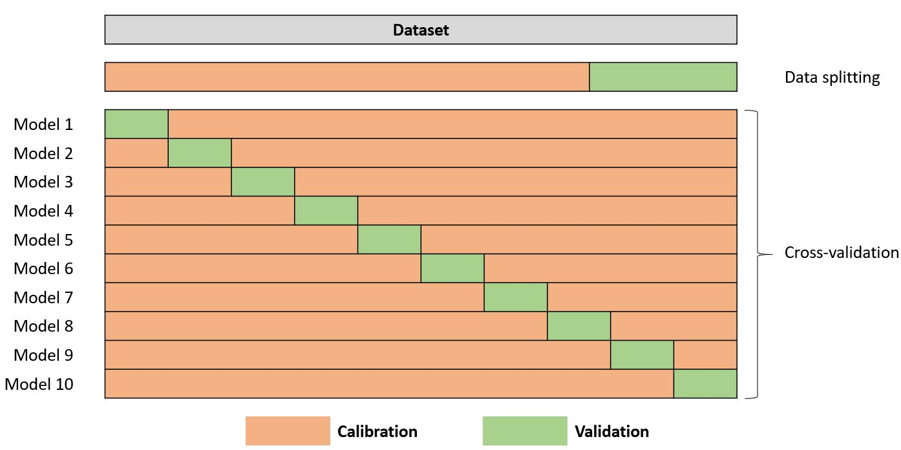

```{r setup, include=FALSE}
library(knitr)
if (knitr::is_html_output() || knitr::is_latex_output()) {
  if (!is.null(knitr::opts_chunk$get("fig.align"))) {
    knitr::opts_chunk$set(fig.align = 'center')
  }
}
```

> Required citation: FAO. 2025. A course on applied data analytics for soil analysis with infrared spectroscopy. Rome.

<blockquote style="background-color:#f0f0f0; padding:15px; border-left:5px solid #ccc;">
<p><strong>Licensing Information</strong></p>

<p>The designations employed and the presentation of material in this information product do not imply the expression of any opinion whatsoever on the part of the Food and Agriculture Organization of the United Nations (FAO) concerning the legal or development status of any country, territory, city or area or of its authorities, or concerning the delimitation of its frontiers or boundaries. The mention of specific companies or products of manufacturers, whether or not these have been patented, does not imply that these have been endorsed or recommended by FAO in preference to others of a similar nature that are not mentioned.</p>

<p>The views expressed in this information product are those of the author(s) and do not necessarily reflect the views or policies of FAO.</p>

<p><strong>ISBN xxx</strong></p>
<p>© FAO, 2025</p>

<p>Some rights reserved. This work is made available under the Creative Commons Attribution-NonCommercial-ShareAlike 3.0 IGO licence (CC BY-NC-SA 3.0 IGO; 
<a href="https://creativecommons.org/licenses/by-nc-sa/3.0/igo/legalcode" target="_blank">https://creativecommons.org/licenses/by-nc-sa/3.0/igo/legalcode</a>).</p>

<p>Under the terms of this licence, this work may be copied, redistributed and adapted for non-commercial purposes, provided that the work is appropriately cited. In any use of this work, there should be no suggestion that FAO endorses any specific organization, products, or services. The use of the FAO logo is not permitted. If the work is adapted, then it must be licensed under the same or equivalent Creative Commons licence. If a translation of this work is created, it must include the following disclaimer along with the required citation:</p>

<p><em>“This translation was not created by the Food and Agriculture Organization of the United Nations (FAO). FAO is not responsible for the content or accuracy of this translation. The original [Language] edition shall be the authoritative edition.”</em></p>

<p>Disputes arising under the licence that cannot be settled amicably will be resolved by mediation and arbitration as described in Article 8 of the licence except as otherwise provided herein. The applicable mediation rules will be the mediation rules of the World Intellectual Property Organization (<a href="http://www.wipo.int/amc/en/mediation/rules" target="_blank">WIPO Mediation Rules</a>), and any arbitration will be conducted in accordance with the Arbitration Rules of the United Nations Commission on International Trade Law (UNCITRAL).</p>

<p><strong>Third-party materials.</strong> Users wishing to reuse material from this work that is attributed to a third party, such as tables, figures, or images, are responsible for determining whether permission is needed for that reuse and for obtaining permission from the copyright holder. The risk of claims resulting from infringement of any third-party-owned component in the work rests solely with the user.</p>

<p><strong>Sales, rights and licensing.</strong> FAO information products are available on the FAO website (<a href="http://www.fao.org/publications" target="_blank">www.fao.org/publications</a>) and can be purchased through <a href="mailto:publications-sales@fao.org">publications-sales@fao.org</a>. Requests for commercial use should be submitted via: <a href="http://www.fao.org/contact-us/licence-request" target="_blank">www.fao.org/contact-us/licence-request</a>. Queries regarding rights and licensing should be submitted to: <a href="mailto:copyright@fao.org">copyright@fao.org</a>.</p>

</blockquote>

<blockquote style="background-color:#f0f0f0; padding:15px; border-left:5px solid #ccc;">
<p><strong>Editing and publication</strong></p>
<p>Matteo Sala (FAO-GSP)</p>

<p>Andy Murray (FAO-GSP)</p>
</blockquote>

```{r, echo=FALSE, results='asis'}
if (!knitr::is_latex_output()) {
  cat("---\n")
  cat("author:\n")
  cat("  - name: \"Alexandre M.J.-C. Wadoux\"\n")
  cat("    affiliation: \"LISAH, Univ Montpellier, AgroParisTech, INRAE, IRD, L'Institut Agro, Montpellier, France\"\n")
  cat("    email: \"alexandre.wadoux@yahoo.fr\"\n")
    cat("  - name: \"Leonardo Ramirez-Lopez\"\n")
  cat("    affiliation: \"Data Science Department, BUCHI Labortechnik AG, Meierseggstrasse 40, 9230 Flawil Switzerland \n") 
  cat("    \n\n Imperial College London, Imperial Business School, South Kensington, Exhibition Rd, London SW7 2AZ, United Kingdom\"\n")
  cat("    email: \"ramirez-lopez.l@buchi.com\"\n")
  cat("  - name: \"Yufeng Ge\"\n")
  cat("    affiliation: \"Department of Biological Systems Engineering, University of Nebraska-Lincoln, Lincoln, Nebraska, USA\"\n")
  cat("    email: \"yge2@unl.edu\"\n")
  cat("  - name: \"Issam Barra\"\n")
  cat("    affiliation: \"Global Soil Partnership, FAO, Roma, Italy\"\n")
  cat("    email: \"Issam.Barra@fao.org\"\n")
  cat("  - name: \"Yi Peng\"\n")
  cat("    affiliation: \"Global Soil Partnership, FAO, Roma, Italy\"\n")
  cat("    email: \"Yi.Peng@fao.org\"\n")
  cat("---\n")
}
```

<style type="text/css">

h1.title {
  font-size: 40px;
  text-align: center;
  font-weight: bold;
}
h3.subtitle {
  font-size: 28px;
  text-align: center;
}
</style>

# Executive summary

This document provides a comprehensive guide to the process of soil spectroscopic modelling, from data acquisition to interpretation, with a focus on using R for analytical modelling. It covers the entire workflow involved in generating reliable predictions of soil properties from spectral data, including data preprocessing, exploratory analysis, calibration, model training, and validation. Practical examples in R are provided throughout, illustrating key steps such as spectral transformation, principal component (PC) analysis, and multivariate regression techniques for predictive modelling. These steps help convert raw spectral data into actionable insights, allowing users to estimate soil attributes like organic carbon (C), clay content, and mineral composition. The document introduces well-known mathematical transfer functions, which correlate spectral wavelengths to soil properties, and how these models can be calibrated using conventional laboratory analysed reference data. Additionally, it explores the challenges of interpreting complex infrared spectra, especially the overlapping absorption bands in the vis-NIR region, and provides strategies to overcome these difficulties. It emphasizes the use of chemometric tools, such as partial least squares (PLS) regression, to extract meaningful relationships between spectral features and soil attributes. This document is the second in a series of three training materials designed to guide users through basic, intermediate, and advanced topics in soil vis-NIR and MIR spectroscopy. The content is aimed at equipping researchers, practitioners and soil laboratory technicians with the knowledge and tools needed to apply spectroscopic techniques for soil analysis, with a focus on practical implementation using R.

# Introduction

**What is soil spectroscopy?**

Soil spectroscopy is concerned with the qualitative and quantitative estimation of soil compounds with spectroscopic data. The visible and near-infrared (vis-NIR) and mid-infrared (MIR, also widely known simply as infrared or IR) regions of the electromagnetic spectrum are gaining interest in soil research. This is because many soil physical, chemical, and biological properties have distinct spectral signatures in these regions. These signatures are characterized by specific peaks, where the intensity is related to a soil compound at a specific band or a complex combination of spectral bands. Chemometric techniques are employed to model the relationships between these complex signatures and soil properties, and yield predictive models for the properties of interest. The modelling results and estimates of soil properties can be used in a series of applications.

Soil spectroscopy has several advantages over conventional laboratory
methods for the estimation of soil attributes. These benefits have been
documented extensively in the past years. Spectral measurements of soil
are relatively rapid and inexpensive, and enable the estimation of several
important soil attributes from a single spectral reading. For these
reasons, spectroscopic analysis is usually more cost-effective than conventional
laboratory methods. Further, preparing of soil samples for spectroscopy
requires minimal efforts (i.e., usually 2 mm
sieving and grinding for homogeneous particle size) and avoids the extensive use of chemical reagents
needed for soil analysis, thus mitigating the overall environmental
impact of a soil survey. Methods for soil spectral analysis are now being applied in the field through the use of proximal soil sensors, enabling *in-situ*
soil scanning.

Figure \@ref(fig:spectrumwavelength) shows the spectrum for all possible
frequencies of electromagnetic radiation and the corresponding
wavelength values. The electromagnetic spectrum ranges from high
frequency $\gamma$ rays ($10^{34}$ Hz or wavelengths shorter than $10^{-13}$
m) to radiowaves, which have long wavelength ($10^8$ m) and low
frequency (10 Hz). Commonly, the ultraviolet, visible, and infrared
ranges are expressed in wavelength with unit micrometer
($\mathrm{\mu}$m) or nanometer (nm), whereas it is expressed in energy
units, usually wavenumber in centimeter (cm$^{-1}$), for the mid- and
far-infrared range. In the infrared ($0.75-1,000$ $\mathrm{\mu}$m;
$750-10^{6}$ nm; $12,500-10$ cm$^{-1}$) range, the radiation interacts
with molecules contained in the soil material, causing the bonds to
vibrate in different modes (such as stretching, bending, or rotating), which provide information on the soil molecular
composition. For example, methyl and methylene groups
in soil have a distinctive absorption area at $2,920$ cm$^{-1}$, which
corresponds to the infrared radiation absorbed by the aliphatic
asymmetric C-H stretch. Directed on a soil sample, the absorbed spectra
at different wavelengths produce a characteristic shape which relates to
the soil sample compounds and can be used for analytical purposes. A
spectrum of a soil sample is therefore generated by recording the amount
of radiation reflected by the sample material for all wavelengths in the
region of study (e.g., the NIR). At those wavelengths where the signal
is absorbed, the reflectance ($R$) radiation decreases. It is
usual to transform the reflectance to apparent absorbance ($A$) through
the relation $A = \log_{10}(1/R)$. For more information, the reader is
redirected to the Soil Spectroscopy Training Manual 1 [@ge2022primer].

```{r spectrumwavelength, out.width = '85%', echo=FALSE, fig.cap= "Electromagnetic spectrum, from @wadoux2021soil with permission.."}

```

The near-infrared (NIR) range is dominated by overtones and combinations
(Figure 1.2) of fundamental vibrations that occur in the mid-infrared
(MIR) range. These fundamental vibrations are conventionally defined in the MIR as symmetric stretching ($\nu_1$), symmetric bending ($\nu_2$),
asymmetric stretching ($\nu_3$), and asymmetric bending ($\nu_4$). In the NIR, these vibrations are termed $\nu$ for stretching and $\delta$
for bending. Occasionally, features in the vis-NIR range arise due to electronic transitions (typically detecting
cations of metals such as Fe and Ti). Molecular vibrations in the MIR have a
range of progressively weaker vibrations and overtones in the NIR
region. This means that NIR spectra have fewer, broader, and overlapping
absorption bands than the MIR region. NIR spectra are thus more
difficult to interpret.

Typically, both the vis-NIR and MIR ranges contain information on
various organic and inorganic soil compounds. Soil carbon content (total
C, inorganic C, organic C) has absorption in the infrared resulting from
overtones of aliphatic C-H stretching, amide C=O stretching, C=H, and
aromatic C=C stretching, among others. However, identification of
several absorption features of organic functional groups is challenging
because they overlap with absorbance of mineral components, particularly
in the range 1400-800 cm$^{-1}$. Absorption of clay minerals occurs due
to hydroxyl O-H stretching and bending, while silicate Si-O stretching
overlaps with bands of organic functional groups. Overtones in the NIR
can result from fundamental vibrations of sulfate (SO4), carbonates
(CO3), and metal-OH bonds. Overall, infrared spectra are strongly
influenced by water, with absorption in the NIR due to a vibration of
H--O--H and in the MIR where absorbance of other soil compounds occurs
(e.g., at 3000 cm$^{-1}$). More details on absorption features are
provided in the Discussion.

```{r spectra, out.width = '90%',  echo=FALSE, fig.cap= "Soil mid-infrared spectra (top) with the X-H stretch, triple bond (TB), double-bond (DB) and fingerprint regions and visible and near-infrared spectra (bottom) showing where the first, second, third overtones (OT) as well as combinations occur."}

```

The practical implications of the difference between vis-NIR and MIR
discussed in the Introduction is that scanning soil in the vis-NIR
range requires less sample preparation. As a result, vis-NIR spectrometry has 
been effectively deployed *in-situ* in the field with miniaturized spectrometers. Although these field instruments can be influenced by environmental conditions, such as soil
moisture, they are not necessarily worse than laboratory spectrometers. Field
spectrometers have become routine and provide valuable assistance in soil monitoring
surveys. especially when a high density of soil observations is required. However, vis-NIR spectrometers are less sensitive to quartz (vis-NIR
spectrometers are often composed of quartz lenses), and MIR
spectrometers are to date almost exclusively restricted to use in the
laboratory.

Soil attributes have often complex absorption patterns in the infrared
range of the electromagnetic spectrum. The main frequencies of spectral
absorptions in the infrared are often non-specific (i.e., they are not
linearly related to a single soil property) and absorption bands overlap
between properties. This is particularly significant in the vis-NIR
range of the spectrum [@soriano2014performance] which is more
difficult to interpret than the MIR range. In addition, certain
properties such as quartz are insensitive in the vis-NIR range, and the
whole infrared range is compounded by scatter effect due to the surface
soil sample surface properties. Several soil attributes (oxides,
carbonates, organic matter, clay minerals) can be detected directly from
the spectra, due to the presence of specific absorption features, while
some other frequently reported properties (e.g., pH) are detected only
because of their association to a combination of spectrally active
components. To extract these complex absorption patterns and obtain
quantitative estimates of a soil property, **soil scientists have used
mathematical transfer functions to correlate spectral wavelengths to
soil attributes. The transfer function is calibrated using the spectral
wavelengths as independent variables and the laboratory measured values
of the soil attributes as the dependent variable. Once calibrated on the
spectra, the soil property can be predicted using the spectral
information only**.

```{r pipeline, echo=FALSE, fig.cap= "The pipeline to obtain quantitative information from soil infrared spectroscopic data."}

```

The steps required for building a reliable spectroscopic model are shown
in Figure \@ref(fig:pipeline). Once the soil material is scanned, the
spectral and physical-chemical data are loaded into the analytics
software in the right and more convenient formats. Spectra need to be
pre-processed using mathematical transformations that aim to improve
their quality and remove undesirable noise. The pre-processed spectra
can then be visualized, and techniques such as principal component
analysis can be used for exploratory analysis. A subset of the soil
samples will be sent to the laboratory for further analysis, which can
be used for building the model. The modeling process includes data
partitioning, model training, and validation. Finally, the model results
are interpreted. All these steps are detailed in the following sections
of this manual and the code with data are available on the [FAO Github
repository](https://github.com/FAO-SID)

# Data loading and visualization

This manual includes `R` code to demonstrate various spectral data
analysis techniques and methodologies. However, it does not provide an
introduction to the `R` programming language itself. For those new to `R`,
we recommend consulting the open book "Introduction to R"
[@Douglas2024IntroR], which offers a comprehensive guide to getting
started with `R`. Additionally, for users interested in utilizing the
`tidyverse` collection of packages [@wickham2019welcome], which are widely used for data
manipulation and visualization, we suggest referring to the book "R for
Data Science" [@wickham2023r]. These resources will provide the basic
knowledge necessary to effectively understand and apply the `R` code
presented in this manual.

## Loading the data 

Preparing and loading the data into the analytics software is an
important first step in our analysis. The way we prepare our data partially
determines how smooth the subsequent processes will be. Here is an
example of how we suggest to do that in `R`, using the
`dat2.csv` file which already contains soil physico-chemical data of several samples along with their respective spectra:

```{r myloadnir, echo = FALSE}
dat <- read.table('data/dat2.csv', sep = ",", header = TRUE)
```

```{r myloadnirnoread, eval = FALSE}
# Since the dat2.csv is separated by commas we use the option sep = ","
# if your data is separated by tab for example, you can use sep = "\t"
# NOTE: the function read.table will look into the current working directory.
# Make sure to have the working directory set to the correct path using the 
# function setwd('your/path/to/file/')
dat <- read.table('dat2.csv', sep = ",", header = TRUE)
```

```{r myload, eval = FALSE}
# lets rename the first column to sample as it indicates the sample index
colnames(dat)[1] <- "sample"
# show how is the current table organized: first 10 rows and first 10 columns
head(dat, c(10, 7))
```

The table contains the sample name in the first column, followed by the
measured soil attributes `Organic_Carbon`, `Clay`, `Silt` and
`Sand`. The spectra follows, starting with the sixth column called
`X350`, which corresponds to the wavelength at 350 nm.

Once we upload the data, we can organize it in a way
that allows us to quickly access the soil attributes and spectra
separately. We recommend to create a `data.frame` where each
non-spectral variable can be accessed directly by its name and all the
spectral variables can be called at once by using one single name. Let's
see how this is done in `R`:

```{r spc-cols}
# This line searches for column names in the 'dat' dataset that match a specific pattern.
# The pattern "X[0-9]{2, 10}$" is a regular expression that:
# - "X": Matches the character 'X' at the start of each spectral column name.
# - "[0-9]{2, 10}": Matches between 2 and 10 digits (0-9) following the 'X'.
# - "$": Ensures that the match occurs at the end of the column name.
# The 'grep' function returns the indices of the column names that match this 
# pattern.
# If in your data, the spectral variables start with another prefix, you should 
# replace "X" with that prefix.
spectral_columns <- grep("X[0-9]{2,10}$", colnames(dat))
```

Now that we know what the columns corresponding to the spectral
variables are, we can just isolate the spectra into a matrix:

```{r props-and-spc}
my_spectra <- as.matrix(dat[, spectral_columns])

# rename the columns to remove the X prefix
colnames(my_spectra) <- gsub("X", "", colnames(my_spectra))
```

We can then readjust our original data as follows:

```{r props-and-spc2}
# Temporarily remove the spectral columns from the 'dat' dataset
dat <- dat[, -spectral_columns]

# Reassign the spectra to 'dat' as a single variable named 'spc_raw'
dat$spc_raw <- my_spectra

# finally remove the object "my_spectra"
rm(my_spectra)
```

With the above code, we have organized our data into a clean structure
where the non-spectral variables are directly accessible by their names
in the `dat` data frame, and the spectral data is consolidated into a
single variable (`spc_raw`). This structure facilitates further analysis by
allowing easy access to both types of data while keeping the dataset
well-organized.

An additional recommendation related to the code style, is that all
`R` object names and variables be assigned in lowercase letters. This
practice helps prevent typos related to case sensitivity, which can
sometimes lead to hard-to-detect code issues or bugs.

For the sake of demonstration, we also load MIR spectra from the same
dataset. Note here that the MIR spectra are loaded for visualization
purposes and not used hereafter. We use the same procedure as for the
vis-NIR data previously loaded.

```{r readmyloadmir, eval = FALSE}
dat_ir <- read.table('dat2MIR.csv', sep = ",", header = TRUE)
```

```{r readmyloadmirnoread, echo = FALSE}
dat_ir <- read.table('data/dat2MIR.csv', sep = ",", header = TRUE)
```

```{r myloadMIR}
colnames(dat_ir)[1] <- "sample"
spectral_columns_ir <- grep("X", colnames(dat_ir))
my_spectra_ir <- as.matrix(dat_ir[, spectral_columns_ir])
colnames(my_spectra_ir) <- gsub("X", "", colnames(my_spectra_ir))
dat_ir <- dat_ir[, -spectral_columns_ir]
dat$spc_raw_ir <- my_spectra_ir
rm(my_spectra_ir)
```

## Data visualization

We can visualize the spectra in `R` using various packages, the simplest
of which are the default `base` packages with the function `matplot`. An
alternative is to use the `ggplot2` package [@ggplot2], which provides more
functionalities to visualize data. We want to create a `ggplot` in `R`
where each row of the dataset is a spectrum and is represented as a
line, and the lines are colored based on the values of the column. One
can follow the steps below. This code uses the `ggplot2` package in `R`.
Note that the first step is to read the dataset and prepare it for
plotting. For illustration purposes we plot the vis-NIR and the MIR
spectra from the `dat2.csv` and `dat2Mir.csv` datasets loaded and
pre-processed in the previous section.

```{r specplot, fig.cap = "Spectra coloured by the content of organic carbon of the samples.", fig.width = 9, fig.height = 8, warning=FALSE,  message=FALSE}
# Install patchwork and ggplot2 in case these libraries are not yet installed
# install.packages("ggplot2")
# install.packages("patchwork")
library(ggplot2)
library(patchwork)

# get the wavelengths of the spectra from the column names and convert them
# into numeric values
my_wavelengths <- as.numeric(colnames(dat$spc_raw))

# get the wavenumbers of the MIR spectra from the column names and convert them
# into numeric values
my_wavenumbers <- as.numeric(colnames(dat$spc_raw_ir))

# For an advanced-looking plot, we will use ggplot
# First we create the long format data frame:
# - 'sample' is repeated for each wavelength to maintain the sample-spectra 
#   relationship.
# - 'oc' (Organic Carbon) is repeated for each wavelength to be used as a color 
#   mapping in the plot.
# - 'wavelength' is repeated for each sample, representing the measurement 
#   points.
# - 'absorbance' is the spectral data values converted to a vector and 
#   transposed to align with 'sample' and 'wavelength'

# NOTE: here we convert the NIR spectra from reflectance to (apparent) absorbance
# as this is the conventional way the spectral information is presented
vnir_long <- data.frame(
  sample = rep(1:nrow(dat), each = ncol(dat$spc_raw)),
  oc = rep(dat$Organic_Carbon, each = ncol(dat$spc_raw)), 
  wavelength = rep(my_wavelengths, nrow(dat)), 
  absorbance = as.vector(t(log(1 / dat$spc_raw, 10)))
)

ir_long <- data.frame(
  sample = rep(1:nrow(dat), each = ncol(dat$spc_raw_ir)),
  oc = rep(dat$Organic_Carbon, each = ncol(dat$spc_raw_ir)), 
  wavenumber = rep(my_wavenumbers, nrow(dat)), 
  absorbance = as.vector(t(dat$spc_raw_ir))
)

# We an now use ggplot to create our spectral plot
# Create the first plot
plot_vnir <- ggplot(
  vnir_long, 
  aes(x = wavelength, y = absorbance, group = sample, color = oc)) +
  geom_line(alpha = 0.5) +  # Set alpha to 0.5 for transparency
  scale_color_gradient(low = "blue", high = "red") +
  theme_minimal() +
  labs(
    x = "Wavelength (nm)",
    y = "Calculated absorbace", 
    color = "Organic Carbon (%)"
  ) +
  theme(legend.position = "top")

# Create the second plot
plot_ir <- ggplot(
  ir_long, 
  aes(x = wavenumber, y = absorbance, group = sample, color = oc)) +
  geom_line(alpha = 0.5) +  # Set alpha to 0.5 for transparency
  scale_color_gradient(low = "blue", high = "red") +
  theme_minimal() +
  labs(
    x = expression(Wavenumber~(cm^{-1})),
    y = "Calculated absorbace", 
    color = "Organic Carbon (%)"
    ) +
  scale_x_reverse() + 
  theme(legend.position = "none")

# Combine the two plots vertically
combined_plot <- plot_vnir / plot_ir

combined_plot
```

The above code performs the following steps:

-   It loads the dataset from `dat.csv`.
-   It saves the `Organic_Carbon` column for later use in coloring the
    lines and then removes this column from the dataset.
-   It converts the dataset from a wide format to a long format, which
    is necessary for plotting multiple lines with `ggplot2`.
-   It uses the organic carbon values for color-coding the spectra.
-   It creates a `ggplot` where each row (i.e. sample in this case) of
    the dataset is represented as a line, with the lines colored based
    on the organic carbon values. The colour gradient goes from blue
    (low values) to red (high values).

# Data pre-processing

## Spectra pre-processing

Applying mathematical pre-processing functions on the raw spectra is the first step, and possibly the most important, in spectral data analysis with chemometrics. When scanning the soil, the soil sample volume and preparation, the measurement method, and measuring parameters such as the choice of scanning time and scanning resolution add noise to the recorded spectral data. Further, when scanning a material with non-uniform particle sizes such as soils, the reflectance spectrum is often accompanied by scattering noise. In fact, the recorded spectrum is not only the result of surface reflection (Fresnel reflection); soil samples absorb radiation that penetrates beneath the surface. As a result, the recorded spectrum depends on the relative amount of radiation absorption and surface reflectance, and lost radiation that is not reflected back to the sensor. In short, the radiation that hits the soil sample is partly reflected, partly absorbed, and partly transmitted. The implication of this phenomenon is that the recorded reflectance spectra do not directly relate to the absorption. A set of simple transformations can be applied to obtain the absorbance spectra. The most basic is the transformation of the reflectance spectral
matrix $R$ by $\log_{10}(1/R)$ or $-\log_{10}(R)$. These transformations
are embedded in all spectral data manipulation packages and software
implementations.

For more detailed information on common preprocessing techniques,
readers can refer to the documentation of the `prospectr` package
[@stevens2014introduction], which provides implementations for various
smoothing, scattering correction, and derivative methods for spectral
processing.

### Splice correction

Before applying standard preprocessing techniques, it is essential to
check if the spectrometer used to record the spectra produces splice
artifacts. These discontinuities often occur in spectrometers equipped
with multiple spectral detectors, such as those with separate detectors
for the visible and NIR regions. For instance, some sensors may produce
splices at 1000 nm and 1830 nm, leading to noticeable "steps" in the
data where measurements from different detectors are combined. These
steps can become problematic for modelling if not addressed, particularly
when derivatives are employed.

Splice correction is a critical process that addresses these artifacts
by linearly interpolating the values at the edges of splice regions,
ensuring a smooth transition between the outputs of different detectors. This
correction minimizes the impact of detector transitions on subsequent
analysis, resulting in continuous and accurate spectral data. The
`spliceCorrection` function in the `prospectr` package [@stevens2014introduction] allows users to
perform this correction by specifying the splice positions and the
number of interpolation bands needed for the desired adjustment.

Let's take another look at Figure \@ref(fig:specplot). If we closely
examine the region around the 1000 nm wavelength, we can observe a
nearly imperceptible artifact that appears as a subtle vertical line.
There is another, less visible artifact around the 1830 nm wavelength.
We anticipated these issues because we know that our data was collected
using a device with three detectors: the first records spectra up to
1000 nm, the second from 1001 nm to 1830 nm, and the third from 1831 nm
onwards.

```{r specplotsplice, fig.cap = "Splice-artifact-free spectra colored by the organic carbon content of the samples.", fig.width = 9, fig.height = 4, warning=FALSE,  message=FALSE}
library(prospectr)

dat$spc <- spliceCorrection(dat$spc_raw, my_wavelengths, splice = c(1000, 1830))

spc_long <- data.frame(
  sample = rep(1:nrow(dat), each = ncol(dat$spc)),
  oc = rep(dat$Organic_Carbon, each = ncol(dat$spc)), 
  wavelength = rep(my_wavelengths, nrow(dat)), 
  reflectance = as.vector(t(dat$spc))
)

# We an now use ggplot to create our spectral plot
ggplot(
  spc_long, 
  aes(x = wavelength, y = reflectance, group = sample, color = oc)) +
  geom_line(alpha = 0.5) +  # Set alpha to 0.5 for transparency
  scale_color_gradient(low = "blue", high = "red") +
  theme_minimal() +
  labs(
    x = "Wavelength (nm)",
    y = "Reflectance", 
    color = "Organic Carbon (%)"
  ) +
  theme(legend.position = "top")
```

Figure \@ref(fig:specplotsplice), shows that the artifact initially
observed in Figure \@ref(fig:specplot) has been removed.

### Smoothing/noise removal

Smoothing of the spectra is typically used to reduce noise.
Examples of methods to remove noise in the spectra include **moving window average** and **Savitzky-Golay filtering**. These techniques help
in smoothing out fluctuations and improving the clarity of the spectral
data. It should be noted that while smoothing is essential, it may need
to be carefully balanced to avoid losing important spectral features.
Additionally, **derivatives** can be applied to the spectra to
accentuate absorbance features and remove both additive and
multiplicative effects. However, derivatives tend to amplify noise, so
smoothing is often recommended before applying derivatives.

In certain cases, specific wavelength portions of the spectra may
exhibit a high signal-to-noise ratio, while the rest of the spectra show
a lower signal-to-noise ratio. In these scenarios, it may be beneficial
to simply remove those portions from our analysis. For example, the
edges of the spectra (typically between 400 nm to 500 nm and from 2450
nm to 2500 nm in the NIR range), tend to be noisy. Trimming these
regions can help improve subsequent spectra analyses.

**Moving window average**

The moving window average, also known as the rolling or running average,
is a simple smoothing technique used in signal processing. It involves
taking the average of a subset of data points within a specified window
that moves across the data set. For each position of the window, the
average of the data points within it is calculated, and this process is
repeated as the window moves through the entire dataset. This technique
helps in reducing noise and making the underlying trends in the data
more apparent.

**Savitzky-Golay Filtering**

The Savitzky-Golay filter is a signal filtering technique that applies
polynomial smoothing to data. Unlike the moving window average, which
replaces each data point with the average of its neighboring points, the
Savitzky-Golay filter fits successive subsets of adjacent data points
with a low-degree polynomial using linear least squares.
When the polynomial degree is zero, the Savitzky-Golay filter behaves
like the moving window average. The primary advantage of this method is
its ability to preserve important features of the data distribution,
such as relative maxima, minima, and peak width, which are often
"flattened" by other averaging techniques. The equation for the
Savitzky-Golay filter is:

$$
\hat{y}_{i} = \frac{1}{n}\sum_{j=-h}^{h}c_{j} \ y_{i+j},
$$

where $n$ is the number of points in the window, $\hat{y}_{i}$ is the
smoothed value of the spectrum at wavelength $i$, $y_{i+j}$ are the
spectrum values within the window centered at $i$, $h$ is half the width
of the window (i.e., the window size is $2h + 1$), and $c_{j}$ is the
coefficient of the polynomial.

Note that Savitzky-Golay filtering is also used for computing signal
derivatives. This is explained in the upcoming section on derivatives,
where the filter's ability to smooth data while preserving derivative
information is particularly valuable.

**Similarities between moving window average and Savitzky-Golay**

-   **Noise reduction**: Both techniques are used to smooth data,
    helping to reduce noise and reveal underlying trends.
-   **Window-based**: They operate over a window that moves across the
    data, applying a calculation to the data points within that window.
-   **Preservation of data structure**: While the Savitzky-Golay filter
    is particularly noted for its ability to preserve the shape of the
    features of the dataset, both methods aim to maintain the integrity
    of the original data as much as possible, albeit in slightly
    different ways.

**Implementation in R**

The `prospectr` package in `R` is designed for the processing and
analysis of spectral data, including soil infrared spectroscopic data.
It includes functions for both moving window average and Savitzky-Golay
filtering.

To illustrate the effect of smoothing, let's use one single spectrum.
Let's take the first spectrum in our dataset and add some (normally
distributed) random noise:

```{r noisyspec, eval = TRUE, warning=FALSE,  message=FALSE}
# Set a seed for reproducibility of random noise
set.seed(801124)

# Add random noise to the first sample's spectrum
my_noisy_spc <- dat$spc[1, ] + rnorm(ncol(dat$spc), sd = 0.0025)
```

Now let's apply the smoothing pre-treatmets to our noisy spectra:

```{r loadprospectr, eval = TRUE, warning=FALSE,  message=FALSE}
library(prospectr)

# Replace 'my_noisy_spc' with your actual data frame or matrix and 'w' with the desired 
# window size
mwa_result <- movav(my_noisy_spc, w = 11)
```

Now Savitzky-Golay filtering with `prospectr`:

```{r svprepro, eval = TRUE, warning=FALSE,  message=FALSE}
# Replace 'my_noisy_spc' with your actual data frame or matrix, 'm' with the window size, 
# and 'p' with the polynomial order
sg_result <- savitzkyGolay(
  my_noisy_spc, # the noisy spectrum
  m = 0, # this m is for the derivative order, 0 is for no derivative
  p = 3, # the polynomial order
  w = 11 # the window size
)
```

In the above examples, `my_noisy_spc` represents your input spectra,
i.e., the spectra that you want to smooth, `w` represents the window
size used for smoothing, and `p` represents the polynomial order used in
the Savitzky-Golay filter. Let us plot the different spectra to observe
the effects of smoothing:

```{r preproexample, fig.cap = "Example of smoothing a noisy spectrum.", eval = TRUE, warning=FALSE,  message=FALSE, fig.width = 8, fig.height = 4}
# Create a long-format data frame for the MVA spectrum
long_mwa_spc <- data.frame(
  wavelength = as.numeric(names(mwa_result)),  # Extract the wavelengths 
  spectral_value = mwa_result,  # Store the spectral values from the MVA 
  method = "mva"  # Label the data
)

# Create a long-format data frame for the Savitzky-Golay (SG) spectrum
long_sg_spc <- data.frame(
  wavelength = as.numeric(names(sg_result)),  # Extract the wavelengths 
  spectral_value = sg_result,  # Store the spectral values from the SG 
  method = "sg"  # Label the data
)

# Combine the long-format MVA and SG data frames into one
denoised_long <- rbind(long_mwa_spc, long_sg_spc) 

# Create a data frame for the original noisy spectrum
original_noisy <- data.frame(
  wavelength = my_wavelengths,  # Use the original wavelengths
  spectral_value = my_noisy_spc  # Use the original noisy spectrum values
)

my_labels <- c(
  "mva" = "Moving average smoothing",
  "sg" = "Savitzky-Golay filtering"
)

# Plot the spectra using ggplot2
ggplot() +
  # Plot the original noisy spectrum as a red line in the background
  geom_line(
    data = original_noisy, 
    aes(x = wavelength, y = spectral_value), 
    color = "black"
  ) +
  # Plot the MVA and SG processed spectra on top of the original noisy spectrum
  geom_line(
    data = denoised_long, 
    aes(x = wavelength, y = spectral_value, color = method, group = method)
  ) +
  # Add titles and labels for the axes
  labs(
    x = "Wavelength (nm)",
    y = "Reflectance"
  ) +
  # Manually set the colors for the MVA and SG lines
  scale_color_manual(
    values = c("mva" = "#00AFBB", "sg" = "#E7B800"), 
    labels = my_labels
  ) +
  # Facet the plot by the method, creating separate plots for MVA and SG
  facet_grid(. ~ method, labeller = labeller(method = my_labels)) +
  theme(legend.position = "top") +  guides(color = guide_legend(title = NULL))
```

With Figure \@ref(fig:preproexample), which illustrates the effects of
different preprocessing methods, we can clearly see that with the
previous code, the noise pretreated spectra becomes less noisy than the
original spectrum. Figure \@ref(fig:preproexample) shows three spectra:
the original spectrum (black line), the MVA-smoothed spectrum (cyan
line), and the SG-smoothed spectrum (yellow line). The x-axis represents
the wavelength (0 to 2500 nm), and the y-axis shows the value (0 to
0.4).

When applying smoothing techniques like moving average (MVA) and
Savitzky-Golay (SG) filtering, selecting the appropriate window size and
polynomial order is of critical importance. Large window sizes can lead
to over-smoothing, flattening the signal and potentially removing
valuable soil information. Conversely, smaller window sizes preserve
more details but might not adequately reduce noise. Higher polynomial
orders in SG filtering can capture more complex trends but may also fit
the noise, making the filtering less effective. On the other hand, low
polynomial orders combined with large window sizes might overly smooth
the data, suppressing important spectral information.

To balance noise reduction and signal preservation, typical window sizes
range from 5 to 15 nm, and polynomial orders from 2 to 6, with 3 being
common for soil spectroscopy. Experimentation and cross-validation are
often needed to determine the optimal parameters for your dataset.

### Scatter corrections

After noise removal, another important pre-processing step is scatter
correction, which aims at enhancing the signal and correct baseline
shifts that may occur due to physical characteristics of the soil, such
as particle size distribution. Scatter correction techniques are
designed to reduce variability between samples caused by scatter and
adjust for baseline shifts. The most commonly used methods for scatter
correction in NIR spectroscopy include **standard normal variate (SNV)** and **multiplicative scatter correction (MSC)**.

Standard Normal Variate (SNV) is a simple and widely
used method that works by centering each individual spectrum to zero and
then dividing each spectral band value by the standard deviation of the
entire spectrum. The SNV method processes each observation
independently. The disadvantage of SNV is that it can be sensitive to
noise.

Multiplicative Scatter Correction (MSC) is also a widely used
pre-processing technique which involves two main steps: estimating
correction coefficients (additive and multiplicative contributions) and
then applying these corrections to the spectrum or spectra to be
corrected [@rinnan2009review]. The purpose of MSC is to remove
undesirable scatter effects from the data matrix before further
modeling. The typical approach uses the average spectrum of the
calibration set as the reference spectrum, although a generic reference
spectrum can also be employed. MSC can be extended to include
higher-order polynomial fitting or incorporate a priori knowledge, but
in most practical applications, the basic form of MSC is sufficient
[@rinnan2009review]. This method effectively preserves spectral features
while reducing background offsets and slopes.

In many cases, the choice between MSC and SNV will depend on the
specific characteristics of the data and the intended use of the
processed spectra. Both techniques are highly effective at reducing
scatter-induced variability, and their application is often preceded by
smoothing methods like Savitzky-Golay filtering to ensure that the
underlying trends in the data are preserved. In addition, because MSC uses a mean or some reference spectrum, it might not be so suitable if one is performing operations across disparate spectral libraries, in which case SNV would be preferred.

**Implementation in R**

For SNV:

```{r snvexample, eval = TRUE, warning=FALSE,  message=FALSE}
# Assume 'dat$spc' is your spectral matrix, where each row is a spectrum
# Apply SNV to each spectrum
snv_spectra <- standardNormalVariate(dat$spc)
```

For MSC:

```{r mscexample, eval = TRUE, warning=FALSE,  message=FALSE}
# Assume 'dat$spc' is your spectral matrix, where each row is a spectrum
# Apply MSC to the spectra
msc_spectra <- prospectr::msc(dat$spc, ref_spectrum = colMeans(dat$spc))
```

### Spectral derivatives

Spectral derivatives are considered a standard tool in spectroscopic
analysis. They are used to remove both additive and multiplicative effects
in the spectra. They help enhance small spectral absorptions, resolve
overlapping absorption features, and compensate for baseline shifts and
instrument drift. However, derivatives can also lead to noise
amplification and make the spectral interpretation more complex, so a
careful application is necessary. Here we describe the basic method used
for computing the derivatives: the Savitzky-Golay method and the
Norris-Gap derivatives, referred hereafter to as Norris-Williams.

#### Savitzky-Golay derivatives

The Savitzky-Golay (SG) method is widely used for calculating spectral
derivatives. In this method, a polynomial is fitted to a subset of data
points within a moving window centered around each point in the
spectrum. The derivative of this (noise-free) polynomial is then
computed at the center of the window. This method allows for the
estimation of first or higher-order derivatives, preserving the
integrity of the spectral signal.

To apply the Savitzky-Golay method in `R` we can use the
`savitzkyGolay()` function from the `prospectr` package:

```{r sgdexample, fig.cap = "Example of smoothing a noisy spectrum.", eval = TRUE, warning=FALSE,  message=FALSE}
# Apply Savitzky-Golay smoothing and compute the first derivative
sg_first_derivative <- savitzkyGolay(
  dat$spc,  # The spectral data 
  m = 1,    # The derivative order (first derivative)
  p = 2,    # The polynomial order (2 i.e fitting a quadratic polynomial)
  w = 11    # The window size 
)

# Apply Savitzky-Golay smoothing and compute the second derivative
sg_second_derivative <- savitzkyGolay(
  dat$spc,  # The spectral data 
  m = 2,    # The derivative order (second derivative)
  p = 2,    # The polynomial order (2 i.e fitting a quadratic polynomial)
  w = 11    # The window size 
)
```

In the above code, `p` represents the polynomial order, `m` is the
derivative order (with 1 for the first derivative and 2 for the second),
and `w` is the window size. The advantage of the Savitzky-Golay method
is that it smooths the data while computing derivatives.

#### Gap-Segment derivatives

This method is also known as Norris-Williams derivatives method. This is
another technique used to calculate spectral derivatives while managing
noise. This method involves two steps: smoothing the spectra over a
specified window and then calculating the derivative with a defined gap
between points. The gap size helps to reduce noise further, making the
method particularly useful for spectral data with high co-variation
[@rinnan2009review].

To apply the gap-Segment derivative method in `R` we can use the
`gapDer()` function from the `prospectr` package: 

```{r gapsegdexample, fig.cap = "Example of smoothing a noisy spectrum.", eval = TRUE, warning=FALSE,  message=FALSE}
# Apply gapDer smoothing and compute the first derivative
gap_first_derivative <- gapDer(
  dat$spc,  # The spectral data 
  m = 1,    # The derivative order (first derivative)
  w = 11,   # The window size
  s = 3     # The segment size 
)

# Apply gapDer smoothing and compute the second derivative
gap_second_derivative <- gapDer(
  dat$spc,  # The spectral data 
  m = 2,    # The derivative order (second derivative)
  w = 11,   # The window size
  s = 3     # The segment size 
)
```

Now let's plot the first and second derivatives of the first spectrum
from our dataset:

```{r derplots, fig.cap = "Examples of the derivatives for the first spectrum in the dataset.", eval = TRUE, warning=FALSE,  message=FALSE, fig.width = 8, fig.height = 8}
library(ggplot2)

# Create the long-format data frame for the different derivatives
long_sg_1der_spc <- data.frame(
  wavelength = as.numeric(colnames(sg_first_derivative)),  # the wavelengths 
  spectral_value = sg_first_derivative[1, ],  # Store the derivatives 
  method = "Savitzky-Golay derivative",  # Label the data
  derivative_order = "1st"
)

long_sg_2der_spc <- data.frame(
  wavelength = as.numeric(colnames(sg_second_derivative)),  # the wavelengths 
  spectral_value = sg_second_derivative[1, ],  # Store the derivatives 
  method = "Savitzky-Golay derivative",   # Label the data
  derivative_order = "2nd"
)

long_gap_1der_spc <- data.frame(
  wavelength = as.numeric(colnames(gap_first_derivative)),  # the wavelengths 
  spectral_value = gap_first_derivative[1, ],  # Store the derivatives 
  method = "Gap-Segment derivative",   # Label the data
  derivative_order = "1st"
)

long_gap_2der_spc <- data.frame(
  wavelength = as.numeric(colnames(gap_second_derivative)),  # the wavelengths 
  spectral_value = gap_second_derivative[1, ],  # Store the derivatives 
  method =  "Gap-Segment derivative",  # Label the data
  derivative_order = "2nd"
)

# Combine all derivatives into one data frame
derivatives_long <- rbind(
  long_sg_1der_spc, long_sg_2der_spc, long_gap_1der_spc, long_gap_2der_spc
)

# Plot the derivatives using ggplot2 with facets for each method
ggplot(
  derivatives_long, aes(x = wavelength, y = spectral_value, color = method)
  ) +
  geom_line() +
  labs(
    x = "Wavelength (nm)",
    y = "Derivative value"
  ) +
  facet_wrap(derivative_order ~ method, scales = "free_y") +
  theme(legend.position = "none")  # Remove the legend as it's redundant with facets
```

Figure \@ref(fig:derplots) shows that while the Savitzky-Golay method
captures detailed spectral features, in this particular case it tends to
introduce more noise in the second derivative. The Gap-Segment method,
on the other hand, provides a cleaner result with less noise in both the
first and second derivatives, making it a better choice for applications
requiring noise reduction in higher-order derivatives.

## Resampling

Resampling is a technique used to adjust the spectral data to new
spectral band positions, either to increase or decrease the resolution
or to align the data with a different set of wavelengths. The `resample`
function in the `prospectr` package facilitates this process by using
either spline or linear interpolation methods. We can specify the
original band positions and the desired new band positions, with the
function returning a resampled matrix or vector that aligns with the new
spectral coordinates. This method is particularly useful when spectral
data needs to be standardized or harmonized for comparison across
different datasets or instruments.

For the rest of this tutorial we will resample the spectral data so they
have a resolution every 5 nm. This can be done with the `resample`
function:

```{r, eval = TRUE}
new_wavs <- seq(from = min(my_wavelengths), to = max(my_wavelengths), 5)

# resample and over-write the original spectral matrix
dat$spc <- resample(
  dat$spc, 
  wav = my_wavelengths, 
  new.wav = new_wavs
)
```

Note that with the above code, the number of spectral variables is
reduced from `r length(my_wavelengths)` to `r length(new_wavs)`.

## Principal Component analysis

Principal Component (PC) analysis is a statistical technique used for
dimensionality reduction while preserving as much of the variability in
the data as possible. It is particularly useful in processing and
analyzing high-dimensional data such as soil spectroscopy data, where
each sample might be represented by a large number of variables (i.e.,
spectral bands). By applying PC analysis, we reduce the spectra data to a few
principal components that capture most of the variability in the
spectra, facilitating the identification of key patterns related to soil
properties. The PCs are used as the basis for a large number of
applications, such as for outlier detection and modeling.

### Understanding PC analysis

Let us consider a spectral dataset represented by the matrix $\mathbf{X}$
of size $n \times p$, where $n$ is the number of samples (spectra) and
$p$ is the number of spectral bands. PC analysis aims to find a transformation
that converts the original spectra dataset into a new set of variables,
called principal components, which are linear combinations of the
original variables. The transformation can be represented as:

$$\mathbf{Z} = \mathbf{X} \mathbf{P}$$,

where $\mathbf{Z}$ is the matrix of scores (coordinates of the original
data in the new principal component space), $\mathbf{X}$ is the centered
(i.e., mean-subtracted) data matrix of spectra, and $\mathbf{P}$ is the
matrix of loadings (eigenvectors of the covariance matrix of
$\mathbf{X}$). The columns of $\mathbf{P}$ are the principal component
loadings ordered by their corresponding eigenvalues in descending order.
The first principal component is the direction that maximizes the
variance of the data, the second principal component is the direction
orthogonal to the first that maximizes the remaining variance, and so
on. The last several components usually represent noise in the data and
account for a very small portion of the explained variance.

**Loadings**: In PC analysis, loadings represent the weights assigned to each
original variable in the calculation of the principal components. They
indicate how much each original variable contributes to its
corresponding principal component. Loadings can reveal patterns and
relationships among the original variables.

**Scores**: The scores are the transformed coordinates of the original
data in the principal component space. The scores indicate the position
of each observation in the new space defined by the principal
components. They can be used to identify similarities and differences
among observations, as well as potential outliers.

### Processing and visualizing principal components

To perform PC analysis on soil spectral data in `R` and visualize the
results using the `ggplot2` library, one needs to follow these steps:

#### Step 1: Scaling

Here we perform mean centering and, if necessary, apply variance scaling
to the spectra.

**Mean centering** involves subtracting the mean spectrum of the entire
dataset from each individual spectrum. This step ensures that PC
analysis identifies the variance of the spectra relative to their mean,
focusing on differences rather than absolute values. Without centering,
PC analysis might incorrectly interpret the overall mean as a
significant source of variation.

**Variance scaling** (or standardizing) ensures that each spectrum has
unit variance by dividing the values of each spectrum by its standard
deviation. This step is necessary to ensure that PCA captures variation
due to differences in the spectral patterns rather than differences in
scale. If the spectra are not scaled, variables with larger scales could
dominate the variance captured by PCA, potentially leading to misleading
results.

By centering and scaling the spectra, PC analysis can effectively reveal
the underlying structure of the data, focusing on the most significant
sources of variation and making it easier to interpret the results.

#### Step 2: Computation of the Principal Components

Here we apply PC analysis using, for example, the `prcomp()` function
from base `R`.

#### Step 3: Visualize the results with plots of the scores and loadings

Here, we create visualizations to interpret the results of the PC
analysis. Using the `ggplot2` library, we can plot the **scores** to
explore the relationships and clustering among the samples in the new
principal component space. This helps in identifying patterns, such as
grouping of similar samples, trends, or potential outliers.
Additionally, we can plot the **loadings** to understand how the
original spectral variables contribute to the principal components. This
helps in identifying which wavelengths are most influential in
explaining the variability within the dataset.

```{r, fig.width = 9, fig.height = 4, warning=FALSE,  message=FALSE}
# Perform PC analysis on the spectra processed with scatter correction (SNV) 
# and Savitzky-Golay smoothing
# The combination of SNV and Savitzky-Golay helps to remove scatter effects 
# and smooth the spectra, preventing artifacts from dominating the principal components.
# This ensures that the PC analysis focuses on the underlying spectral patterns 
# relevant to soil attributes.
pca_result <- prcomp(
  savitzkyGolay(standardNormalVariate(log10(1 / dat$spc)), m = 1, p = 1, w = 3), 
  center = TRUE, scale. = TRUE
)
```

Note that in the above code we apply the Savitzky-Golay derivative and
SNV transformation before the PC analysis. This helps mitigate the
impact of future unseen baseline shifts and scattering effects, which
can arise after changes in the optical components of the spectrometer or
significant alterations in scanning conditions. These preprocessing
steps ensure that PC analysis focuses on the true spectral patterns,
making the resulting models more robust to such variations in future
measurements.

The code above performs PC analysis of the pretreated spectra of `dat`,
scaling the data before the analysis, and stores the result in
`pca_result`.

```{r myscores, fig.cap = "Scatter plot of the scores of the first two principal components.", fig.width = 4, fig.height = 4, warning=FALSE,  message=FALSE}
# Plotting the scores of the first two principal components
scores <- as.data.frame(pca_result$x)
ggplot(scores, aes(x = PC1, y = PC2)) +
  geom_point(alpha = 0.5) +
  labs(x = "PC 1", y = "PC 2")
```

The previous code creates a scatter plot of the first two principal
components (PC1 and PC2). In Figure \@ref(fig:myscores) each point
represents a spectrum from the original dataset, with coordinates
determined by the scores of the first two principal components. PC1,
plotted on the x-axis, captures the largest variance in the data, while
PC2, on the y-axis, captures the second largest variance. The spread of
points along these axes indicates the variability among observations,
with some distant points that can potentially be considered as outliers.

```{r loadingsplot, fig.cap = "First three loading spectra resulting from our PC analysis.",  fig.width = 7, fig.height = 4, warning=FALSE,  message=FALSE}
# Extract the loadings
loadings <- pca_result$rotation

# Create a data frame for the first three loadings
loadings_df_long <- data.frame(
  component = rep(paste0("PC", 1:ncol(loadings)), each = nrow(loadings)), 
  wavelengths = rep(as.numeric(rownames(loadings)), ncol(loadings)),
  value = as.vector(loadings)
)

# Plotting the first three loadings
ggplot(
  loadings_df_long[loadings_df_long$component %in% c("PC1", "PC2", "PC3"), ], 
  aes(x = wavelengths, y = value, color = component, group = component)
) +
  geom_line() +
  labs(x = "Wavelength (nm)", y = "Loading value") +
  scale_color_manual(
    values = c("PC1" = "#00AFBB", "PC2" = "#E7B800", "PC3" = "#FC4E07")
  ) +
  theme(legend.position = "top") +  guides(color = guide_legend(title = NULL))
```

The above code creates a plot of the first three PC loadings. The
colours for the loadings are manually set. Figure
\@ref(fig:loadingsplot) shows how each wavelength contributes to the
first three principal components (PC1, PC2, and PC3). The x-axis
represents the wavelengths, while the y-axis shows the loading values,
reflecting the strength and direction of the contribution of each
wavelength. The plot includes three lines, each representing one of the
principal components, with blue for PC1, yellow for PC2, and red for
PC3. This visualization helps in understanding the influence of each
spectral band on the principal components, elucidating the underlying
structure and relationships within the data.

### Choosing the number of components

The number of components to use for any subsequent analysis can be
determined using a scree plot. A scree plot displays the eigenvalues, or
the amount of variance explained by each principal component, on the
y-axis, with the components ordered by their eigenvalues on the x-axis.
Typically, the plot reveals a distinct point where the magnitude of the
eigenvalues drops off, commonly referred to as the "elbow." This elbow
point is an indicator of the optimal number of components to retain, as
the components to the left of the elbow explain a significant portion of
the variance, while those to the right contribute less and are often
considered noise. The rationale behind this method is to select a subset
of components that capture most of the spectral data variation while
avoiding the inclusion of components that provide minimal information.

When creating a scree plot in `R`, it is possible to calculate the
variance explained by each principal component and plot it against the
number of components. In this example, we visualize only the first 20
components in the scree plot.

```{r screeplot,  fig.cap = "Scree plot for our PC analysis.", fig.width = 6, fig.height = 4, warning=FALSE,  message=FALSE}
# Calculate variance explained by each component
var_explained <- pca_result$sdev^2 / sum(pca_result$sdev^2)

# Create a data frame for plotting (keep the first 20 components only)
components <- data.frame(Component = 1:20, Variance = var_explained[1:20])

# Create the scree plot
ggplot(components, aes(x = Component, y = Variance)) +
  geom_line() + geom_point() +
  scale_x_continuous(breaks = 1:length(var_explained)) +
  labs(x = "PC", y = "Explained spectral variance") +
  theme_minimal()
```

Figure \@ref(fig:screeplot) suggests that the first component is the
most important, it explains about `r round(var_explained[1], 2)*100`% of
the variance, followed by the second and third components which also
contribute to explaining the variance of the original spectral dataset
but to a small extent. After the tenth component, the additional
components contribute very little to explaining the variance. Based on
this scree plot, one might decide to retain the first nine or ten
principal components for further analysis. Together they explain about
`r round(sum(var_explained[1:10]), 2)*100`% of the original variance.

Typically, when PC analysis is applied to raw spectra, a large portion
of the original spectral variance is captured in the first few principal
components, often the first three. This can be due to the presence of
"hidden" spectral features that are not yet fully revealed. If the
spectra are rich in information, it is unlikely that the full variation
is captured in just three components. Therefore, signal enhancing
pre-processing usually results in a larger number of components that
capture the complexity and richness of the spectral data.

### Biplot

A biplot is a summary figure that can be used to visualize the results
of PC analysis. It simultaneously displays information on both the
scores and the loadings. A biplot helps to visualize how strongly each
wavelength (or wavenumber) influences the principal components and how
observations are distributed in the principal component scores space. In
a biplot, each point represents a single spectrum from the dataset. The
distribution of the points in the biplot indicates the similarity among
the spectra. The vectors represent the loadings, where the direction of
a vector indicates the contribution of a wavelength to the principal
component, and the length of the vector reflects the strength of this
contribution.

```{r biplot,  fig.cap = "Biplot of the first two principal components with selected variable loadings.", fig.width = 5, fig.height = 5, warning=FALSE,  message=FALSE}
# Adding row names as a column for plotting
loadings <- as.data.frame(loadings)
scores <- as.data.frame(scores)
loadings$variable <- rownames(loadings)
scores$observation <- rownames(scores)

# Filter loadings_df to include only selected variables
selected_variables <- c("400", "1250", "2300")
filtered_loadings_df <- loadings[loadings$variable %in% selected_variables, ]

# Plotting observations
gg <- ggplot() +
    geom_point(
      data = scores, aes(x = PC1, y = PC2, color = "observations"), alpha = 0.5
      ) +
    scale_color_manual(
      values = c("observations" = "blue", "variables" = "red")
      ) +
    theme_minimal()

# Adjusting arrow length
gg <- gg + geom_segment(
    data = filtered_loadings_df, 
    aes(x = 0, y = 0, xend = PC1 * 1000, yend = PC2 * 1000, color = "variables"), 
    arrow = arrow(type = "open", length = unit(0.2, "inches"))
)

# Adding selected variable labels
gg <- gg + geom_text(
    data = filtered_loadings_df, 
    aes(x = PC1 * 1000, y = PC2 * 1000, label = variable), 
    hjust = 1.2, vjust = 1.2
)

# Increase the limits of the axes
gg <- gg + xlim(-75, 75) + ylim(-75, 75) +
    theme(legend.position = "top") +  guides(color = guide_legend(title = NULL))

gg
```

The biplot (Figure \@ref(fig:biplot)) shows how individual spectra are
distributed across the first two principal components (PC1 and PC2). The
wide spread of points along the PC1 axis indicates that PC1 captures a
substantial portion of the variance in the original data. Spectra that
are close together in the plot are more similar to each other, while
those further apart show greater differences in their spectral
characteristics.

The red vectors represent specific wavelengths (400, 1250, and 2300 nm),
showing how these wavelengths contribute to the principal components.
The direction of each vector indicates the influence of that wavelength
on the principal components, while the length of the vector reflects the
strength of that influence. Spectra that are positioned close to a
vector (e.g., near the 2300 nm vector) likely have stronger absorption
features associated with that particular wavelength.

# Spectral data modelling

## Selecting samples for building a calibration set (calibration sampling)

Given that spectroscopic measurements are generally fast and
cost-effective, it is feasible to scan all available soil samples across
the visible, NIR, and MIR regions, or combinations thereof. However,
when calibrating spectroscopic models, both the spectra and reference
values for soil attributes obtained through conventional methods are
required. Due to the higher costs and longer time needed for
conventional analyses, it is important to carefully select a
representative subset of soil samples, referred to as the calibration
set, to be sent to the laboratory [@wadoux2021soil].

The size and selection method of this calibration set are critical to
the quality of the resulting model that relates soil attributes to
spectra [@ramirez2014sampling]. Several sampling designs can be used, including simple random
sampling and more sophisticated methods like k-means clustering, which
involves creating unsupervised clusters within the spectral space and
sampling from each cluster. Another effective approach is conditioned
Latin hypercube sampling [@minasny2006conditioned], which aims to uniformly cover the empirical
distribution of the spectra while maintaining the correlation structure
among spectral variables, typically represented by principal component
scores. 

In all sampling design approaches, the spectra are first summarized into
a few components using dimensionality reduction techniques such as
PC analysis. The sampling design is then applied
to the first few principal component scores. This way, the spectral
dataset, which is often high-dimensional (many spectra and thousands of
wavelengths), is summarized into a lower-dimensional space (see also the
previous section).

The number of samples to be sent to the laboratory should, ideally, be
as small as possible to save costs, but without compromising the
accuracy of the subsequent chemometric models. As a simple rule, the
representativity of a subsample for a given sampling design can be
assessed by computing the difference between the probability density
function of the subsample and that of the entire set of available
spectra. Examples in the literature include @ramirez2014sampling and
@nawar2018optimal. Here, we do not provide examples of such approaches
because the number of samples to be sent to the laboratory is usually
guided by the cost of the analysis.

### Kennard-Stone sampling
Kennard-Stone sampling [@kennard1969computer] is a method used to select a subset of samples
from a larger dataset in such a way that the selected samples cover the
variability of the entire dataset as much as possible. The Kennard-Stone
algorithm works by first selecting the two samples that are the most
distant from each other in the dataset based on Euclidean distance.
Subsequent samples are selected iteratively, each time choosing the
sample that has the maximum minimum distance to all previously selected
samples. This process continues until the desired number of samples has
been selected.

In `R` this can be performed using the `kenStone()` function of the
`prospectr` package. Recall that this is done in the PC scores space. We
assume that we want to select 30 samples for laboratory analysis.

```{r, fig.width = 6, fig.height = 4, warning=FALSE,  message=FALSE}
# the target subset size to be selected
nn = 30

# the number of PCs to use 
n_pcs <- 10

# select the samples with Kennard Stone
selected <- kenStone(
  pca_result$x[, 1:n_pcs],      # the input are the scores of the PC
  k = nn,            # number of samples to select
  metric = 'mahal',  # the distance metric
  .center = TRUE, 
  .scale = FALSE
)    

# show the results. Here we are only interested on the row with the 'model' name. 
str(selected)
```

We proceed to the next step: plotting the selected samples alongside the
full dataset using ggplot2 to visualize the results in 2D.

```{r kssampling,  fig.cap = "Kennard-Stone sampling (on the principal component space) for selecting the calibration subset.",  fig.width = 6, fig.height = 4, warning=FALSE,  message=FALSE}
scores$kss_selected <- FALSE 
scores$kss_selected[selected$model] <- TRUE  

# Plot using ggplot2
ggplot(
  scores[!scores$kss_selected, ], 
  aes(x = PC1, y = PC2, color = kss_selected, shape = kss_selected)
) +
  geom_point(size = 2, alpha = 0.7) +
  geom_point(size = 3, data = scores[scores$kss_selected, ]) +
  theme_minimal() +
  labs(x = "PC1",
       y = "PC2",
       color = "",
       shape = "") +
  scale_color_manual(
    values = c("TRUE" = "red", "FALSE" = "black"),
    labels = c("TRUE" = "Selected samples", "FALSE" = "Not selected samples")
  ) +
  scale_shape_manual(
    values = c("TRUE" = 16, "FALSE" = 16),
    labels = c("TRUE" = "Selected samples", "FALSE" = "Not selected samples")
  ) +
  theme(legend.position = "top") 
```

The provided code snippet uses the `ggplot2` library to create a scatter
plot of the results from the PC analysis. The code identifies the
selected samples based on a model from a data frame called `scores`. It
then filters the `scores` data frame to create separate subsets: one for
all points and another for the selected points, which are identified
using the Kennard-Stone algorithm. The `scores` data frame contains
columns for the first and second principal components (PC1 and PC2) and
a logical column indicating whether each point is selected.

The plot (Figure \@ref(fig:kssampling)) is generated by first plotting
the non-selected points with a smaller size and reduced opacity, and
then overlaying the selected points with larger, more prominent markers.
The non-selected points are displayed as black solid circles, while the
selected points are shown as larger red circles.

The resulting image from this code presents a scatter plot in which the
majority of the data points (not selected) are displayed in black, with
the selected points highlighted in red. This visualization effectively
shows the distribution of the selected samples within the principal
component space, emphasizing their placement relative to the entire
dataset, which is particularly useful for understanding the selection
made by the Kennard-Stone algorithm during the PC analysis.

### Conditionned Latin hypercube sampling

Conditioned Latin hypercube sampling (cLHS, @minasny2006conditioned) is
a sampling design that aims to cover the multidimensional space of the
spectral data. This is a similar objective to Kennard-Stone, but it is
achieved differently. In cLHS, the variables (here, the PC scores) are
divided into intervals, called strata. The number of strata is equal to
the number of samples to be selected. This division is done for
all variables (i.e., scores). In cLHS, the objective is to sample within
each stratum. An optimization algorithm with an objective function is
used to achieve this goal.

The objective function in cLHS has two main goals. The first goal is to
ensure that all strata are covered by a sampling point in the
multidimensional space. The second goal is to account for the
correlation between variables. To optimize these criteria, simulated
annealing is commonly employed, although many other optimization
algorithms are available. Simulated annealing works by testing various
sampling solutions and retaining the ones that provide the best value
for the objective function. This iterative process continues until a
predefined convergence criterion is met, such as reaching a specific
number of iterations.

cLHS is a popular sampling design in spectroscopy and is also widely
used in environmental sciences. We can
implement cLHS on the spectroscopic data using the `clhs` package [@clhs].

```{r clhsampling,  fig.cap = "cLHS sampling (on the principal component space) for selecting the calibration subset.", fig.width = 6, fig.height = 4, warning=FALSE,  message=FALSE}

library(clhs)  # Load the cLHS package for Conditioned Latin Hypercube Sampling

# Set the seed for reproducibility of the random sampling process
set.seed(801124)  

# Perform Conditioned Latin Hypercube Sampling (cLHS)
selected_clhs <- clhs(
  x = scores[, 1:n_pcs],  # Use the first n_pcs principal components
  size = nn,  # Specify the number of samples to be selected (nn)
  iter = 1000,  # Set the number of iterations for simulated annealing
  simple = FALSE  
)

# Generate plots to visualize the cLHS results, 
# typically including diagnostics like the objective 
# function's progress over iterations
plot(selected_clhs) 
```

The Figure \@ref(fig:clhsampling) illustrates the changes in the
objective function values throughout the iterations of the simulated
annealing algorithm. This plot provides a visual assessment of how
effectively the objective function was minimized during the optimization
process. Initially, there is a sharp decrease in the objective function
value, which gradually levels off as the number of iterations increases.
This pattern suggests that the algorithm made significant progress early
on, with diminishing improvements as it approached an optimal or
near-optimal solution. Such a figure is commonly used to monitor the
convergence of an optimization algorithm, showing how well the algorithm
minimizes (or maximizes) the objective function over time.

```{r clhsampling2,  fig.cap = "Conditioned Latin hypercube sampling (on the principal component space) for selecting the calibration subset.",  fig.width = 6, fig.height = 4, warning=FALSE,  message=FALSE}
scores$clhs_selected <- FALSE 
scores$clhs_selected[selected_clhs$index_samples] <- TRUE  

# Plot using ggplot2
ggplot(
  scores[!scores$clhs_selected, ], 
  aes(x = PC1, y = PC2, color = clhs_selected, shape = clhs_selected)
) +
  geom_point(size = 2, alpha = 0.7) +
  geom_point(size = 3, data = scores[scores$clhs_selected, ]) +
  theme_minimal() +
  labs(x = "PC1",
       y = "PC2",
       color = "",
       shape = "") +
  scale_color_manual(
    values = c("TRUE" = "red", "FALSE" = "black"),
    labels = c("TRUE" = "Selected samples", "FALSE" = "Not selected samples")
  ) +
  scale_shape_manual(
    values = c("TRUE" = 16, "FALSE" = 16),
    labels = c("TRUE" = "Selected samples", "FALSE" = "Not selected samples")
  ) +
  theme(legend.position = "top") 
```

The provided code uses `ggplot2` to create a scatter plot of principal
component analysis results, highlighting samples selected using
Conditioned Latin Hypercube Sampling (cLHS). The `selected_clhs` object
stores indices of selected samples, which are then marked in the
`scores` data frame. In the plot (Figure \@ref(fig:clhsampling2)),
selected samples are shown as larger red circles, while non-selected
samples appear as smaller black circles. This visualization demonstrates
how cLHS effectively selects a representative subset within the PCA
space, covering the spectral variation of the dataset. 

## Modelling

### Definition of the response and predictor variables

Throughout this document, we primarily use the organic carbon content as
the main response variable and the derivative of the scatter-corrected
absorbance spectra as the predictor variables.

```{r responsepredictors}
# Prepare the data

# Define the response variable (organic carbon content)
y <- as.matrix(dat$Organic_Carbon) 
# Our set of predictors
x <-  savitzkyGolay(
  standardNormalVariate(log10(1 / dat$spc)),  
  m = 1, p = 1, w = 3  
)
```

### Partial Least Squares Regression

Partial Least Squares Regression [@wold2001pls] (PLSR) is a statistical method used to
model linear relationships between input variables and responses. It is
particularly useful when the predictors are highly collinear or when the
number of predictors exceeds the number of observations, as is often the
case in soil spectroscopy. PLSR identifies relationships between two
matrices (denoted as $\mathbf{X}$ and $\mathbf{Y}$), such that the
covariance between the dependent variables in $\mathbf{Y}$ and the
independent variables in $\mathbf{X}$ is maximized. This is achieved
through a dimensionality reduction technique similar to PCA, but while
PCA focuses on explaining the variance in $\mathbf{X}$ only, PLSR
focuses on maximizing the covariance between $\mathbf{X}$ and
$\mathbf{Y}$.

In statistical terms, let the decomposition of the $\mathbf{X}$ and
$\mathbf{Y}$ matrices be expressed as:

$$
\mathbf{X} = \mathbf{T}\mathbf{P}^\top + \mathbf{E},
$$

$$
\mathbf{Y} = \mathbf{T}\mathbf{C}^\top + \mathbf{F},
$$ 
where $\mathbf{X}$ is the spectral data matrix, and $\mathbf{Y}$ is
the matrix of response variables. The matrix $\mathbf{T}$ contains the
scores (latent variables) for $\mathbf{X}$, $\mathbf{P}$ contains the
loadings for $\mathbf{X}$, $\mathbf{C}$ contains the loadings for
$\mathbf{Y}$, and $\mathbf{E}$ and $\mathbf{F}$ are the residual
matrices for $\mathbf{X}$ and $\mathbf{Y}$, respectively.

The scores matrix $\mathbf{T}$ is calculated to maximize the covariance
with the responses $\mathbf{Y}$. This is achieved by regressing
$\mathbf{Y}$ on $\mathbf{T}$ and using the regression coefficients
$\mathbf{B}$ to compute the predicted values of $\mathbf{Y}$. The
relationship can be written as: 
$$
\mathbf{\hat{Y}} = \mathbf{T}\mathbf{B}\mathbf{C}^\top,
$$ 

where $\mathbf{B}$ is obtained during the iterative process of
maximizing the covariance between $\mathbf{T}$ and $\mathbf{Y}$. Once
the regression coefficients are obtained, predictions can be made using
this equation.

PLSR is perhaps the most widely used quantitative method in spectroscopy
in general. It is used to correlate the intensity at various wavelengths
with the concentrations of different chemicals or physical soil
properties. Beyond quantitative measures, PLSR can also assist in
qualitative analysis, such as identifying the presence of specific
compounds or determining the quality of a sample based on its spectral
signature. Below, we demonstrate an example of PLSR for quantitative
analysis using `R`.

We will use the `pls` package [@pls], which is designed for partial least
squares regression. If it is not already installed, we will need to
install it first. We extract the `Organic_Carbon` as the response
variable and the wavelength variables as our predictors. We need to
ensure that these predictors are numeric and have no missing values.
Using the `pls` package, we fit a PLS regression model. The number of
components to use can be determined based on cross-validation, similar
to PC analysis but this time based on internal cross-validation results.
For simplicity, we use the functions provided by the `pls` package, but
later in this document, we also explain how to obtain validation
statistics and perform cross-validation on your own.

```{r, fig.width = 6, fig.height = 4, warning=FALSE,  message=FALSE}
# Load necessary libraries
library(pls)

# Fit the PLSR model
plsr_model <- plsr(y ~ x, ncomp = 20, validation = 'CV')

# Summary of the model
summary(plsr_model)
```

The results show that using around 12 components is optimal for this
dataset, as it provides a low cross-validation error and a reasonable
explanation of the variance in `Organic Carbon`. Beyond this point, the
increase in the number of components does not significantly improve the
performance of the model and may lead to overfitting, as indicated by
the increase in Root Mean Square Error of Prediction (RMSEP) values.

This analysis suggests that the PLSR model with around 10 components
effectively captures the relationship between the wavelengths and
`Organic Carbon`, making it a suitable model for prediction within this
dataset.

```{r plsrmsep, fig.cap = "Validation plot for the PLSR model.", fig.width = 6, fig.height = 4, warning=FALSE,  message=FALSE}
# Plotting
plot(
  plsr_model, 
  plottype = "validation", main = NA, 
  xlab = "PLSR component", ylab = "Organic Carbon RMSEP (%)"
) 
grid()
```

Figure \@ref(fig:plsrmsep) is showing the RMSEP on the y-axis against
the number of components on the x-axis. This graph is typically used to
determine the optimal number of components in a model by identifying the
point where the RMSEP is minimized before it starts to increase,
indicating overfitting. Here it confirms that the optimal number of
components for PLSR is 10.

Finally, we evaluate the model using cross-validation and plot the
results. This includes looking at validation statistics to assess the
model performance. We can create plots to visualize i) the regression
coefficients to see which wavelengths are most important and ii) the
predicted vs. actual values to assess the model fit.

```{r plscoeffval, fig.cap = "Left: Regression coefficients across wavelengths for the optimal 10 PLSR components. Right: Predicted vs. measured organic carbon values, with the red line indicating the ideal 1:1 fit.", fig.width = 8, fig.height = 4, warning=FALSE,  message=FALSE, fig.show="hold"}
# Indicate the optimal number of PLSR components based on prior analysis
optimal_ncomp <- 10

# Extract the regression coefficients for the optimal number of components
selected_coeff <- plsr_model$coefficients[, , optimal_ncomp]

# Set up the plotting area to display two plots side by side
par(mfrow = c(1, 2))

# Plot 1: Regression coefficients against wavelengths
plot(
  x = as.numeric(names(selected_coeff)),  
  y = selected_coeff,                     
  type = "l",                             
  xlab = "Wavelengths (nm)",            
  ylab = "Regression coefficients",
  main = "Regression coefficients"
)
grid()                                  

# Predict the response variable using the optimal number of components
y_hat <- predict(plsr_model, ncomp = optimal_ncomp)

# Plot 2: Predicted vs. Measured values
plot(
  y_hat, y,                               
  xlab = 'Predicted Organic Carbon (%)',  
  ylab = 'Measured Organic Carbon (%)',   
  xlim = range(y_hat, y),                 
  ylim = range(y_hat, y),                 
  pch = 16,                               
  col = rgb(0.5, 0.5, 0.5, 0.7), 
  main = "Predicted vs measured"
)
abline(0, 1, col = "red")  # Add a 1:1 perfect fit line
grid()                                    
par(mfrow = c(1, 1))
```

The Figure \@ref(fig:plscoeffval) (left) illustrates the PLSR regression
coefficients across different wavelengths. The x-axis represents
wavelengths ranging from 355 to 2495 nm, while the y-axis shows the
corresponding regression coefficients, spanning from approximately -8 to
11. The fluctuations in the coefficients indicate the varying influence
of different spectral regions on the predictions made by the model, with
certain wavelengths playing a more pronounced role.

The Figure \@ref(fig:plscoeffval) (right) is a scatter plot comparing
the predicted organic carbon values against the measured values, based
on the PLSR model with 10 components. The x-axis displays the predicted
organic carbon percentage, while the y-axis represents the measured
values. The points are generally aligned along the red 1:1 line,
indicating that the model predictions are fairly accurate. However, some
deviations from this line suggest prediction errors. This plot is
essential for assessing the accuracy of the PLSR model in predicting
soil organic carbon content.

### Cubist
Cubist [@quinlan1992learning] is a machine learning algorithm that is particularly popular in
the field of soil spectroscopy for predictive modeling [@minasny2008regression]. It combines
aspects of decision trees with linear regression models to create
rule-based ensemble models that are both interpretable and accurate.

The foundation of Cubist models consists of decision trees. However,
unlike conventional decision trees that have terminal nodes with
constant values, Cubist models employ linear regression models at these
nodes. This approach allows the model to capture both non-linear
relationships between variables through the tree structure and linear
relationships within the subsets of data defined by the tree rules.

The key features of Cubist include:

1)  it is a rule-based model that generates rules to split the dataset
    into subsets, with each rule corresponding to conditions based on
    the input features;

2)  at each terminal node of these rules, a linear model is fitted to
    the subset of data that meets the rule conditions;

3)  multiple models, also called committees, can be built and averaged
    to improve prediction accuracy;

4)  Cubist can handle both continuous and categorical data, making it versatile for various
    applications.

In `R`, Cubist models can be trained using the `Cubist` package [@cubist].

```{r, fig.width = 6, fig.height = 4, warning=FALSE,  message=FALSE, fig.show="hold"}
# Load the packages
library(Cubist)

# Define the model using the caret package
cubist_fit <- cubist(y = y, x = x)

# Print the model summary
cubist_fit
```

The output of the previous code describes a Cubist model fitted to a
dataset with `r nrow(x)` samples and `r ncol(x)` predictors, targeting
the prediction of `Organic_Carbon`. This model configuration uses a
single committee, meaning it consists of one ensemble model, and it has
generated two rules. These rules are derived from the predictors to
segment the data into subsets, within which linear regression models are
applied to predict the `Organic_Carbon` content. The fact that only two
rules were generated suggests that the relationship within the data
might be relatively simple and straightforward.

```{r, fig.width = 6, fig.height = 4, warning=FALSE,  message=FALSE, fig.show="hold"}
# Summarize the output rules
summary(cubist_fit)
```

The output describes a Cubist model trained on a dataset with
`r nrow(x)` samples and `r ncol(x)` predictors, targeting the prediction
of an outcome variable. The model comprises two rules:

-   **Rule 1** applies to 157 cases and predicts the outcome using a
    linear combination of various spectral attributes. The mean outcome
    for this rule is approximately 1.44, with a range from 0.07 to 3.73,
    and an estimated error of about 0.41.

-   **Rule 2** applies to 143 cases and also uses a linear combination
    of attributes for prediction, with a mean outcome of approximately
    2.49, ranging from 0.13 to 4.92, and an estimated error of about
    0.65.

The evaluation on the training data shows an average absolute error of
about 0.57, a relative error of 0.63, and a correlation coefficient of
0.76, indicating a moderate linear relationship between the predicted
and actual outcomes. The model uses all listed attributes extensively
(100% usage), indicating their significant role in the model
construction.

### Random forest
Random Forest (RF) [@breiman2001random] is an ensemble machine learning method used extensively in
soil spectroscopy for predicting soil attributes from spectral data. In
RF, multiple decision trees are built during calibration. The final
output is the mode of the classes (for classification) or the mean
prediction (for regression) of the individual trees. Individual trees in
an RF are built using a technique called bootstrap aggregating [@breiman1996bagging], or
bagging. Each tree is constructed from a different bootstrap sample of
the data. A bootstrap sample is a random sample of the dataset with
replacement, meaning the same data point can appear multiple times in
the sample. At each node of the tree, a random subset of features is
selected, and the best split on these features is used to split the
node. This process introduces randomness into the model, which helps
reduce variance and prevents overfitting.

The RF algorithm has three main parameters: Mtry, the number of trees,
and the minimum node size.

*Mtry* determines the number of features to consider when looking for
the best split at each node. Depending on the setting, it can be a fixed
number of features, a percentage of the total features, or other
variations like the square root or log of the total number of features.
The choice of Mtry affects the diversity of the trees in the forest;
lower values increase the diversity among the trees, helping to reduce
model variance.

*Number of trees* defines the number of trees in the forest. Generally,
more trees increase the performance and make the predictions more
stable, but they also increase the computational cost. Typically, there
is a point of diminishing returns where increasing the number of trees
no longer improves the model significantly.

*Minimum node size* specifies the minimum number of samples required to
split an internal node. Higher values prevent the model from learning
overly specific patterns, thus lowering the risk of overfitting.
However, too high a value can lead to underfitting, as the model might
not be able to capture important distinctions in the data.

In `R`, the implementation of RF can be accessed through several
packages, with the most traditional being the `randomForest` package [@randomForest]. It
offers a straightforward approach to both classification and regression
tasks and includes functionalities for assessing variable importance and
generating partial dependence plots. However, for larger datasets or
more computationally intensive tasks, the `randomForest` package can be
slow. To address these limitations, we will use the `ranger` package [@wright2017ranger] for
our RF implementation. Ranger is optimized for speed and can handle
larger datasets more efficiently. It is written in `C++` and offers a
faster execution time compared to the `randomForest` package, which is
especially beneficial when dealing with high-dimensional data as in soil
spectroscopy.

```{r, fig.width = 6, fig.height = 4, warning=FALSE,  message=FALSE, fig.show="hold"}
# Load the ranger package
library(ranger)

# Set seed for reproducibility (as our model has a random component)
set.seed(801124)

# Fit Random Forest model
rf_model <- ranger(
  x = x,              # Predictor variables
  y = y,              # Response variable
  num.trees = 500,    # Number of trees
  importance = 'impurity' # Calculate variable importance
)

rf_model
```

The code output indicates that our Random Forest regression model uses
500 trees, with 20 variables considered at each split (Mtry), determined
by the square root of the total number of predictors. The model applies
impurity-based variable importance and a variance split rule.

Key metrics include an Out-of-Bag (OOB) prediction error, reported as a
Mean Squared Error (MSE) of 0.558 (squared units), which is equivalent
to a RMSEP of 0.747 % (considering that $RMSEP = \sqrt{MSE}$) and an
OOB R-squared of 0.555. These metrics indicate the ability of the model
to explain variance in the target variable, with the OOB R-squared value
showing that approximately 55.5% of the variance in organic carbon is
explained by the model.

```{r rfval, fig.cap = "Random Forest predicted values vs. measured organic carbon values, with the red line indicating the ideal 1:1 fit.", fig.width = 4, fig.height = 4, warning=FALSE,  message=FALSE, fig.show="hold"}

# Predicted vs. Measured values for Random Forest
plot(
  rf_model$predictions, y,                 # Use RF model predictions                               
  xlab = 'Predicted Organic Carbon (%)',  
  ylab = 'Measured Organic Carbon (%)',   
  xlim = range(rf_model$predictions, y),  # Update x-axis limit                 
  ylim = range(rf_model$predictions, y),  # Update y-axis limit                 
  pch = 16,                               
  col = rgb(0.5, 0.5, 0.5, 0.7)
)
abline(0, 1, col = "red")  # Add a 1:1 perfect fit line
grid()        
```

Figure \@ref(fig:rfval) shows the Random Forest predicted organic carbon
values on the x-axis and the respective measured values on the y-axis,
both ranging from 0 to 5 %. The data points are dispersed across the plot,
generally clustering around the red diagonal line. This line represents
the ideal 1:1 relationship where predicted values would perfectly match
the observed values. The proximity of the points to this line provides a
visual indication of the prediction accuracy, with points closer to the
line representing more accurate predictions. The scatter of points
around the line suggests some variability in the prediction accuracy,
which is common in model evaluations.

## Model evaluation

### Cross-validation

In previous examples of model fitting for PLSR, Cubist and RF, we
used the internal functions of the packages to return the prediction
error of the model. In this section we will show you how to obtain this
error from a validation dataset. This error will be used in the next
section to calculate validation statistics.

Two common forms of validation are data splitting and cross-validation.
Data splitting involves dividing the dataset into separate subsets,
typically known as the calibration set and the validation set. The model
is trained on the calibration set and then evaluated on the validation
set to assess its performance on unseen data. This method helps in
understanding how well the model generalizes to new data.

Cross-validation, on the other hand, is a more robust method where the
data is divided into $k$ subsets or folds. The model is trained on $k-1$
folds and tested on the remaining fold, and this process is repeated
such that each fold serves as the validation set once. This technique is
particularly useful in soil spectroscopy for reducing variability and
ensuring that the model performance is not dependent on a particular way
of splitting the data.

```{r CV, out.width = '85%', echo = FALSE, fig.cap= "Representation of the two forms of validation in infrared soil spectroscopy, by data spliting or cross-validating the original dataset.", fig.width = 5, fig.height = 4.7}

```

Figure \@ref(fig:CV) illustrate the two approaches for validation.

**Data splitting**: The original dataset is divided into distinct
sections: a larger calibration set and a smaller validation set. Usually
we take 70% for calibration and 30% for validation. The model is fitted
on the calibration set and predicts the values of the target variable on
the validation set. From the comparison on the validation set of
observed and predicted values we can calculate validation statistics.

**Cross-validation**: The original dataset is divided into multiple
equal segments, each labeled as a fold. We usually divide the dataset
into 10 folds for 10-fold cross-validation. The image shows a cyclic
process where each fold is used as a validation set in turn while the
others are combined to form a calibration set.

In `R` data splitting can be done by manually splitting the dataset into
calibration and validation sets using base `R` functions. Let us assume a
70-30 split.

```{r, fig.width = 6, fig.height = 4, warning=FALSE,  message=FALSE,fig.show="hold"}
set.seed(123)  # Ensure reproducibility

# Randomly select a subset of row indices from the 'dat' dataset.
# 'sample' function is used to draw a random sample of indices.
# '1:nrow(x)' generates a sequence from 1 to the total number of samples.
# 'size' specifies the number of indices to sample (70% of the total samples).
random_indices <- sample(1:nrow(x), size = floor(0.7 * nrow(x)))


# Keep the calibration set for spectra and dependent variable
calibration_x <- x[random_indices, ]
calibration_y <- y[random_indices]

# Keep the validation set for spectra and dependent variable
validation_x <- x[-random_indices, ]
validation_y <- y[-random_indices]

# Fit a model on the calibration set
rf_model_cal <- ranger(x = calibration_x, y = calibration_y, num.trees = 500)

# Predict on the validation set
rf_y_hat <- predict(rf_model_cal, validation_x)$predictions

# Compare the observed and predicted values of the validation set
head(data.frame(observed = validation_y, predicted = rf_y_hat))
```

The previous code shows the process of creating a predictive model using
RF, specifically focusing on predicting organic carbon content from
spectral data. Initially, the code sets a random seed to ensure that the
results are reproducible. It then randomly splits the dataset into a
calibration set (70% of the data) and a validation set (30% of the data)
using random sampling. The calibration set is used to train the model,
where `calibration_x` contains the spectral data and `calibration_y`
contains the corresponding organic carbon values. Similarly,
`validation_x` and `validation_y` are prepared for the validation set. A
RF model (`rf_model_cal`) is then fitted to the calibration data using
the `ranger` function, specifying 500 trees. After the model is trained,
it is used to predict the organic carbon content of the validation set.
Finally, the code compares the observed values of organic carbon
(`validation_y`) with the predicted values (`rf_y_hat`) by displaying
them side-by-side in a data frame for the first few observations. This
later information can be used to calculate validation statistics.

Let us make the same with cross-validation by dividing the dataset into
10 parts and use each part as a validation set once, while the remaining
parts serve as the calibration set.

```{r, fig.width = 6, fig.height = 4, warning=FALSE,  message=FALSE, fig.show="hold"}
nn <- nrow(x)
n_folds <- 10
folds <- sample(rep(1:n_folds, length.out = nn))
results <- vector("list", 10)  # To store results from each fold

for(i in 1:n_folds) {
  ith_validation_indices <- which(folds == i)
  ith_calibration_indices <- setdiff(1:nn, ith_validation_indices)
  
  # Keep the calibration set for spectra and dependent variable
  ith_calibration_x <- x[ith_calibration_indices, ]
  ith_calibration_y <- y[ith_calibration_indices]
  
  # Keep the validation set for spectra and dependent variable
  ith_validation_x <- x[ith_validation_indices, ]
  ith_validation_y <- y[ith_validation_indices]
  
  set.seed(123)  # Ensure reproducibility
  # Fit a model on the calibration set
  ith_rf_model_cal <- ranger(
    y = ith_calibration_y, 
    x = ith_calibration_x, 
    num.trees = 500
  ) 
  
  # Predict on the validation set
  ith_predictions <- predict(ith_rf_model_cal, ith_validation_x)$predictions
  
  # Store observed and predicted values
  results[[i]] <- data.frame(
    observed = ith_validation_y, predicted = ith_predictions
  )
}

# Combine all results into one data frame
all_results <- do.call(rbind, results)

# Print the combined results to check
print(head(all_results))
```

The previous code performs a 10-fold cross-validation for a random
forest model using the `ranger` package to predict organic carbon
content from spectral data. Each fold is used once as the validation
set, while the remaining data serves as the calibration set. The RF
model is trained on the calibration set and then used to predict the
validation set. Observed and predicted values from all folds are
combined into a single data frame, `all_results`, which is printed to
show the initial results. This approach provides a thorough evaluation
of model performance.

### Validation with statistical indices

After completing the cross-validation process, we can evaluate the
quality of the predictions made by the model. This evaluation is
typically done by performing a pairwise comparison of the observed and
predicted values. While there are numerous validation statistics
available, we will focus on explaining and calculating four main
metrics: the mean error (ME), root mean squared error (RMSE), Pearson's
$r$ correlation coefficient and R-squared (or modeling efficiency).
These metrics together provide a comprehensive view of the model
prediction quality.

The **Mean Error (ME)** evaluates the systematic deviation of the
predictions from the observed values, indicating the bias of the
predictions: 

$$
ME = \frac{1}{n}\sum_{i=1}^{n}(\hat{y}_i - y_i),
$$ 
where $\hat{y}$ are the predicted values and $y$ are the observed
values. A ME close to 0 indicates predictions with low bias.

```{r, fig.width = 6, fig.height = 4, warning=FALSE,  message=FALSE, fig.show="hold"}
mean_error <- mean(all_results$predicted - all_results$observed)
```

The **Root Mean Squared Error (RMSE)** measures the average magnitude of
the prediction errors, providing an overall assessment of prediction
accuracy: 

$$
RMSE = \sqrt{\frac{1}{n}\sum_{i=1}^{n}(\hat{y}_i - y_i)^2}
$$

Lower values of RMSE indicate better predictive accuracy. The RMSE has
the unit of the target variable.

```{r, fig.width = 6, fig.height = 4, warning=FALSE,  message=FALSE, fig.show="hold"}
rmse <- sqrt(mean((all_results$predicted - all_results$observed)^2))
```

The **Pearson's** $r$ correlation coefficient measures the linear
correlation between observed and predicted values, indicating the
strength and direction of a linear relationship. It ranges from -1 to 1
and is calculated as: 

$$
r = \frac{\sum_{i=1}^n (y_{i} - \overline{y})(\hat{y}_i - \overline{\hat{y}})}{\sqrt{\sum_{i=1}^n (y_i - \overline{y})^2} \sqrt{\sum_{i=1}^{n}(\hat{y}_i - \overline{\hat{y}})^2}}.
$$

```{r, fig.width = 6, fig.height = 4, warning=FALSE,  message=FALSE, fig.show="hold"}
pearsons_r <- cor(all_results$observed, all_results$predicted)
```

The **R-squared** (or modeling efficiency) assesses the goodness of fit,
showing how well the variance in the observed data is explained by the
model. It is obtained by: 

$$
R^2 = 1-\frac{\sum_{i=1}^{n} (y_i - \hat{y}_i)^2}{\sum_{i=1}^{n} (y_i - \overline{y})}.
$$ 

The R-squared has an ideal value of 1 and can be negative if the
model is a worse predictor than using the mean of the data as predictor.

```{r, fig.width = 6, fig.height = 4, warning=FALSE,  message=FALSE, fig.show="hold"}
ss_res <- sum((all_results$observed - all_results$predicted)^2)
ss_tot <- sum((all_results$observed - mean(all_results$observed))^2)
r_squared <- 1 - (ss_res / ss_tot)
```

We can create a summary of the four statistics:

```{r, fig.width = 6, fig.height = 4, warning=FALSE,  message=FALSE, fig.show="hold"}
validation_summary <- data.frame(
  mean_error = mean_error,
  rmse = rmse,
  pearson_corr = pearsons_r,
  r2 = r_squared
)

print(validation_summary)
```

The statistics reveal a Pearson's correlation coefficient of 0.75,
indicating a strong positive linear relationship between observed and
predicted values. The R-squared value of 0.54 suggests that
approximately 54% of the variance in the dependent variable is
explained by the model. The Mean Error is minimal at 0.0113, implying
that the model does not systematically overestimate or underestimate the
observed values. However, the RMSE of 0.76 indicates moderate average
errors in the predictions.

### Uncertainty of predictions

Uncertainty quantification in soil spectroscopy is crucial for several
reasons. It provides a measure of confidence in the predictions made by
spectroscopic models, which is essential for decision-making in
agricultural management, environmental monitoring, and soil health
assessment. Uncertainty quantification helps in understanding the
reliability of the predictions and in determining the risk associated
with decisions based on these predictions. Several methods exist for
quantifying the uncertainty of prediction made by a model. Uncertainty
can readily be obtained with PLSR and other statistical models. It is
more complicated for machine learning models such as cubist and random
forests, although solutions exist notably with bootstrapping [@rossel2007robust]. Here we
present a straightforward method to obtain uncertainty intervals using
quantile regression forest.

Quantile regression forests [@meinshausen2006quantile] (QRF) is an extension of the RF algorithm,
designed to provide estimates for conditional quantiles of the response
variable, rather than focusing solely on the conditional mean. While RF
predicts a single mean response for each set of input features by
averaging the predictions of numerous decision trees, QRF uses the
entire conditional distribution of the outcomes generated from the leaf
nodes of the trees. This distribution is used to estimate different
quantities and quantiles (e.g. the median, the quartiles). This makes
QRF very useful in scenarios where understanding the variability of the
prediction, such as the range or the likelihood of extreme values, is as
important as predicting the mean. QRF provides estimates of the
uncertainty of predictions, which is not typically available with
machine learning algorithms. Hereafter we obtain the standard deviation
of the prediction by sampling from the conditional distribution and
taking the variance of all the samples.

```{r qfreds, fig.cap= "Validation plot for the predicted organic Carbon values using quantile regression forests. The yellow lines indicate the standard deviation of the predictions.", fig.width = 5, fig.height = 5, warning=FALSE,  message=FALSE,fig.show="hold"}
library(matrixStats)

set.seed(801124)  # Ensure reproducibility

# Fit the quantile regression forest (QRF) model
# `quantreg = TRUE` enables the quantile regression option
qrf_model <- ranger(x = calibration_x, y = calibration_y, quantreg = TRUE)

# Predict quantiles using the QRF model
# `type = "quantiles"` specifies quantile predictions
# `what = function(x) sample(x, 100, replace = TRUE)` simulates 100 
# samples from the predicted quantiles
qrf_predictions <- predict(
  qrf_model, 
  validation_x, 
  type = "quantiles", 
  what = function(x) sample(x, 100, replace = TRUE)
)

# Calculate the mean predictions from the 100 simulations
qrf_yhat <- rowMeans(qrf_predictions$predictions)

# Calculate the variance of predictions from the 100 simulations
qrf_yhat_variance <- rowVars(qrf_predictions$predictions)

# Create a dataframe for plotting, containing observed and predicted values
qrf_plot_data <- data.frame(observed = validation_y, predicted = qrf_yhat)

# Plot: Predicted vs. Measured values for quantile Random Forest
plot(
  x = qrf_yhat, y = validation_y,                                             
  xlab = 'Predicted Organic Carbon (%)',  
  ylab = 'Measured Organic Carbon (%)',   
  xlim = range(qrf_yhat, y),  # Set x-axis limit                 
  ylim = range(qrf_yhat, y),  # Set y-axis limit                 
  pch = 16,                               
  col = "white"  # Initial plot with white color to add error bars first
)

# Add error bars representing the standard deviation of the predictions
arrows(
  x0 = qrf_yhat - sqrt(qrf_yhat_variance),  
  y0 = validation_y,                        
  x1 = qrf_yhat + sqrt(qrf_yhat_variance),  
  y1 = validation_y,                       
  code = 3, angle = 90, length = 0.02, col = rgb(1, 0.65, 0, 0.7) 
)


# Add the points for predicted vs. observed values
points(
  x = qrf_yhat, y = validation_y,
  pch = 16,                               
  col = rgb(0, 0, 0, 0.7)  
)

# Add a 1:1 perfect fit line (diagonal) in red
abline(0, 1, col = "red")

# Add a grid to the plot for better visualization
grid()    
```

The previous code demonstrates how to fit a QRF model using the `ranger` package, with organic carbon as the
response variable and preprocessed spectra as the predictors. The model
is set up for quantile regression by enabling the `quantreg = TRUE`
argument. After the model is trained, it simulates the distribution of
predicted values by drawing 100 samples with replacement. The mean and
variance of these predictions are then calculated to summarize the
central tendency and uncertainty.

Figure \@ref(fig:qfreds) shows the validation results where each black
point represents a predicted sample value versus observed organic carbon
values. The red diagonal line indicates where predictions would
perfectly match the observations, serving as a reference for perfect
model accuracy. The yellow error bars, extending from each dot,
represent the standard deviation of the predictions, providing a visual
measure of the uncertainty associated with each prediction. Longer error
bars indicate greater uncertainty. This combined visualization helps to
assess both the accuracy of the model and the confidence in its
predictions, making it easier for readers, especially beginners, to
understand the performance and reliability of the model.

### Interpretation of contributing wavelengths
In soil spectroscopy, identifying the most influential wavelengths (or
wavenumbers) that contribute to model predictions is essential. We
previously demonstrated this approach in the section on PLSR.
Understanding which parts of the spectra are crucial for predicting a
target variable not only aids in interpreting the results but also
enhances model diagnostics. This understanding clarifies the underlying
mechanisms driving the predictions and helps refine the model for
improved accuracy and reliability.

Several methods exist for determining important wavelengths. In PLSR,
regression coefficients can be used for this purpose. In RF, a variable
importance metric is typically reported alongside the predictions. Here,
we introduce a model-independent technique based on Shapley values. This
approach can be applied to any model to report wavelength (or
wavenumber) specific importance metrics.

Shapley values [@shapley1953s], derived from cooperative game theory, have been adapted
for machine learning model interpretation. They allocate the "payout"
(i.e., the prediction output) among the "players" (i.e., the features or
inputs of the model). Each Shapley value quantifies the contribution of
a single feature to the prediction of the model, considering all
possible combinations of features. This is achieved by systematically
evaluating the change in prediction that occurs when a feature is added
to a subset of other features, averaged over all possible subsets. The
result is a fair distribution of importance across all features,
highlighting the impact of each feature on the output of the model. This
method is particularly useful for complex models where feature
interactions are non-trivial, as it provides clear, actionable insights
into how and why certain features influence the predictions of the
model [@wadoux2023interpretable].

Hereafter we use the `fastshap` package [@greenwell2020package], which provide a fast implementation for estimating the Shapley values from @vstrumbelj2014explaining. 

```{r shapley, fig.cap= "Wavelength contribution to organic Carbon predictiona in spectral data using quantile regression forests.", fig.width = 6, fig.height = 4, warning=FALSE,  message=FALSE, fig.show="hold"}
library(fastshap)

# Create custom predict function that returns the predicted values as a vector
predict_with_qrf <- function(model, newdata)  {
  results <- predict(model, newdata)$predictions
  return(results)
}

# Calculate Shapley values using fastshap
# (NOTE that the following computations might take a while)
ishapley <- fastshap::explain(
  qrf_model,
  X = validation_x,
  pred_wrapper = predict_with_qrf,
  nsim = 50
)

# Aggregate Shapley values
# Create a data frame to store the aggregated Shapley values
# 'wavelength' is extracted from the column names of 'ishapley'
# 'importance' is calculated as the mean of the absolute Shapley values for
# each wavelength
s_importance <- data.frame(
  # Convert column names (wavelengths) to numeric
  wavelength = as.numeric(colnames(ishapley)),
  # Compute mean absolute Shapley values
  importance = apply(ishapley, MARGIN = 2, FUN = function(x) mean(abs(x)))
)

# Plot the aggregated Shapley values as an area plot
ggplot(s_importance) +
  geom_area(
    aes(x = wavelength, y = importance),
    fill = "red", alpha = 0.6
  ) +
  scale_y_continuous(expand = c(0,0)) +
  labs(x = "Wavelength (nm)", y = "Absolute contribution")
```

Our code uses a QRF model to predict organic carbon content from
spectral data and to quantify the uncertainty of these predictions.
Shapley values are computed for each wavelength to determine their
contribution to the predictions. The final plot displays the absolute
contributions of these wavelengths.

The Figure \@ref(fig:shapley) illustrates the importance of different
wavelengths (in nm) in predicting organic carbon. The x-axis represents
the wavelengths used as input to the model, while the y-axis shows the
absolute contribution of each wavelength, with values ranging from
approximately 0 to 0.05. The plot is created by aggregating the Shapley
values, which quantify the influence of each wavelength on the model's
predictions.

The data shows that while many wavelengths contribute minimally (with
values close to 0), several distinct peaks exist, indicating that
certain wavelengths have a significantly higher influence. Notably, a
prominent peak is observed around 2260 nm, indicating this substantial
impact of the wavelength on the predictions of the model. This relationship is confirmed by the literature which suggest association with known organo-mineral complexes [@stenberg2010visible], see also the next Section. Other smaller
peaks are distributed across the spectrum, highlighting the non-uniform
contribution of different spectral regions to the predictive model.
These peaks reveal which parts of the spectrum are most critical for
accurate predictions, offering insights into the model's behavior and
the underlying data characteristics.

# Discussion and conclusion

## What can we estimate with soil infrared spectroscopy?

Below is a brief summary of what properties can be estimated with
infrared spectroscopy. For a more complete description the reader is
redirected to @stenberg2010visible, @soriano2014performance and
@fang2018visible.

### Chemical properties

**Soil minerals** Soil minerals are diverse and play a crucial role in
soil composition. The most common soil minerals include clay minerals
(e.g., smectite, vermiculite, illite, kaolinite) and iron oxides (e.g.,
hematite, goethite). These minerals result from the degradation of
primary minerals, and their quantity depends on the chemical nature of
the soil environment. Clay minerals exhibit distinct absorption patterns
in the near-infrared (NIR) and mid-infrared (MIR) ranges, which can be
attributed to specific chemical groups. see @rossel2009situ and
@chukanov2016infrared. For instance, the hydroxyl (O-H) stretching and
metal-OH bending modes are observed in the regions of 3400-3750
cm$^{-1}$ and 600-950 cm$^{-1}$, respectively. Silicate absorption
occurs in the 700-1200 cm$^{-1}$ region due to Si-O stretching, and in
the 150-600 cm$^{-1}$ region due to bending, which overlaps with Al-O
stretching and bending.

Kaolinite, a 1:1 layer silicate, exhibits fundamental stretching and
deformation vibrations in the MIR. It shows two or more O-H stretching
bands in the range of 3600-3700 cm$^{-1}$, with a characteristic doublet
at 3700 and 3620 cm$^{-1}$. The band near 920 cm$^{-1}$ is related to
Al-OH deformation vibrations, while the bands near 1115, 1033, and 1008
cm$^{-1}$ are characteristic of Si-O vibrations. In the NIR, the
well-known doublet absorption occurs near 2200 nm and 1400 nm,
corresponding to the Al-OH bend and O-H stretch combination, and the
overtone of the O-H stretch at 3620 cm$^{-1}$, respectively.

The 2:1 layer alumino-silicates, such as smectite (e.g.,
montmorillonite) and illites, exhibit a single and broad absorption band
between 3620 and 3700 cm$^{-1}$, corresponding to the O-H stretching of
structural hydroxyl groups. Montmorillonite smectites have resolved O-H
deformation bands at 915 cm$^{-1}$ (AlAlOH) and 840 cm$^{-1}$ (AlMgOH),
as well as an absorption near 3373 cm$^{-1}$ due to the O-H stretching
of water. Illite is characterized by the combination of the broad
absorption near 3622 cm$^{-1}$ and the bands near 825 and 750 cm$^{-1}$.

Metal oxides, such as gibbsite, hematite, and goethite, also have
characteristic absorption patterns in the MIR and NIR ranges. Gibbsite
(Al(OH)3) has absorption bands near 3540 and 1000 cm$^{-1}$ due to O-H
stretching, while goethite ($\alpha$-FeOOH) and hematite
($\alpha$--Fe$_2$O$_3$) exhibit specific Fe-O and FeO-H absorbance in the
3400-3000 cm$^{-1}$ and 900-700 cm$^{-1}$ regions.

Soil carbonates, such as calcite or dolomites, have diagnostic
absorptions in the MIR near 1450, 880, and 700 cm$^{-1}$, corresponding
to the vibrational modes of the free CO3$^{2-}$ ion. The NIR contains
the combinations and overtones of these fundamental CO3 vibrations,
occurring near 2500 and 2330 nm.

Quartz, one of the few soil minerals that can be semi-quantitatively
determined from its MIR spectra, has several sharp peaks in the range of
1100-1000 cm$^{-1}$ and 700-800 cm$^{-1}$ due to the fundamental O-Si-O
stretching and bending. The doublet at 800 and 781 cm$^{-1}$ is often
used for identification.

**Organic matter** Soil organic matter (SOM) is the sum of all organic
material found in the soil, and it plays a crucial role in various soil
chemical and physical functions. The absorption of organic matter in
different frequencies of the infrared spectrum has been extensively
studied, allowing for the understanding of qualitative and quantitative
properties of SOM. A review is made in @margenot2023fourier.

In the mid-infrared (MIR) range, organic matter absorbance related to
organic functional groups has several well-defined peaks that can permit
semi-quantitative assessment of SOM chemistry, provided additional data
on the soil matrix is available or mineral absorbance is removed. These
peaks include amide N-H (3380 cm$^{-1}$), aliphatic C-H (2930, 1465
cm$^{-1}$), aromatic C=C (1520 cm$^{-1}$), phenol and carboxyl C-O (1275
cm$^{-1}$), and polysaccharide C-O (1170 cm$^{-1}$), see
@margenot2017application and @demyan2012use.

In the near-infrared (NIR) region, the absorption results from vibration
of chemical bonds corresponding to several of the SOM chemical groups,
such as C-H, N-H, and C-O. The ranges 1600-1900 and 2090-2630 nm contains
most of the important SOM absorptions, but bands higher than 2000 nm can
be confounded with several organic and inorganic molecules that absorb
in this region.

Chemometric modeling has been widely used to extract the vast amount of
SOM information contained in the NIR and MIR spectra of bulk soils.
Studies have shown that both NIR and MIR spectroscopy can be used to
predict organic matter and its compounds, such as organic C and total N,
with high correlation between measured and predicted values
[@dalal1986simultaneous;@ben1997reflectance;@janik1998can].

To improve the characterization of SOM functional groups in the MIR
range, strategies such as spectral subtraction techniques or chemical
pre-treatment have been employed. Spectral subtraction involves removing
the OM from the soil sample, followed by the subtraction of the scan of
the treated soil sample from the original scan on the bulk soil. This
enables better understanding of the peaks related to organic components
of the soil sample. Alternatively, organic absorbance may be enhanced by
demineralization procedures with hydrofluoric acid (HF), which has been
shown to improve SOM characterization with MIR spectroscopy.

**Macro- and micronutrients** Soil spectroscopy has been widely used to
estimate soil macronutrients, such as N, P, Ca, K, Mg, and S, due to
their direct relationship with plant nutrition and soil fertility
[@ng2022mid]. These macronutrients, except for mineral N, have a
relatively constant level over time, making them suitable for fertilizer
optimization and precision agriculture.

Nitrogen (N) is the most important nutrient for plant growth and soil
fertility. N is strongly correlated with soil organic matter (SOM) and
the spectrally active amide groups in SOM. While total and organic N can
be estimated accurately using NIR and MIR spectroscopy, estimating N
fractions and mineral N is more challenging, with variable results
reported in the literature.

Phosphorus (P) estimation has also been relatively well-studied, with a
focus on extractable P. The variance explained in the existing studies
on soil spectroscopy is variable, likely due to the different laboratory
methods used to measure available P. Better results have been obtained
for estimating P sorption and total P, although the latter is less
useful for understanding plant nutrition.

Potassium (K) estimation has been less successful, as exchangeable K is
influenced by properties that are not spectrally active in the NIR or
MIR, such as K+ concentration in the soil solution. Overall, poor
results are obtained when estimating K forms, with exchangeable K better
predicted by NIR and total K better predicted by MIR.

Magnesium (Mg) and calcium (Ca) are spectrally active due to their
association with carbonates and clay minerals. NIR and MIR spectroscopy
can provide accurate estimates of exchangeable and total Mg and Ca, with
MIR being more suited for total Mg and NIR for exchangeable Mg.

In contrast to macronutrients, soil micronutrients (B, Cl, Co, Cu, Fe,
Mn, Mo, Na, Ni, and Zn) have been less studied, and their estimation
using NIR and MIR spectroscopy is highly variable. Their estimation is
often dependent on covariation with spectrally active soil compounds,
and nutrients that depend more on the soil solution than the soil matrix
are less likely to be accurately estimated.

**pH and lime requirement** Soil pH is a crucial indicator of potential
soil fertility, influencing various soil processes such as
mineralization and biological activity. When the pH is too low (acidic soils), liming is applied to
neutralize sources of acidity. Both pH and lime requirement can be
estimated using near-infrared (NIR) and mid-infrared (MIR) spectroscopy,
which correlate the spectral response to soil attributes like organic
matter and clay minerals.

The relationship between soil pH and infrared spectroscopy is complex,
with conflicting results reported in the literature. Some studies found
correlations between pH and bands associated with cation exchange
capacity and clay minerals, while others did not find a correlation with
clay. Carbonates were identified as an influential factor. The bands
associated with pH-correlated soil attributes vary across different soil
types.

Despite the complexity, soil pH can be accurately estimated using NIR
and MIR spectra. Estimation of pH in CaCl2 is slightly more accurate
than estimation of soil pH in water, with a median root mean square
error of 0.29 for pH in water and 0.30 for pH in CaCl2 [@janik1998can].

Lime requirement, defined as the quantity of calcium carbonate needed to raise
the pH of the first 10 cm by 1 pH unit, can also be estimated using NIR
and MIR spectroscopy. MIR is generally more suitable as it can estimate
quartz and organic matter more accurately. While the spectroscopic
methods can estimate lime requirement accurately, the variable results
are often attributed to large errors in estimating lime requirement
in the lab rather than to the spectroscopy itself.

It is important to note that estimating soil pH and lime requirement
with infrared spectroscopy should be done with caution, as excess lime
can lead to trace element immobilization. The error in estimating pH is
often around one-third of a pH unit, corresponding to a lime requirement
of up to 10-15 tons of limestone per hectare in a clayey soil
[@stenberg2010visible].

### Physical properties

Soil physical properties play a crucial role in regulating various
processes within the soil ecosystem, including compaction, erodibility,
water and nutrient dynamics, and heat and air flow
[@soriano2014performance]. These properties can be characterized by
attributes such as soil texture fractions, soil structural
characteristics, and soil water properties.

Soil aggregation, including the stability of aggregates and the
distribution of micro- and macro-aggregates, has been estimated using
near-infrared (NIR) and mid-infrared (MIR) spectroscopy
[@soriano2014performance]. These techniques have shown promising
results, with the variance accounted for ranging from 0.46 to 0.60 for
NIR and 0.53 for MIR. MIR spectroscopy has been found to be more
suitable for predicting soil aggregate properties compared to NIR.

Knowledge of soil water content is crucial for the development of
effective irrigation systems and successful plant growth. Spectroscopic
methods, including the mid-infrared (MIR), near-infrared (NIR), and
visible-near-infrared (Vis-NIR) regions, have been used to predict
gravimetric soil water content with moderate to high success (R$^{2}$ values
ranging from 0.83 to 0.89, and as high as 0.98 for the UV-Vis-NIR
region) [@bouma1989using]. The NIR region has slightly outperformed the
other spectral ranges, with a median R$^{2}$ of 0.89.

Soil water content at field capacity and wilting point has also been
well predicted using infrared spectroscopy. Field capacity water content
has been correlated with infrared spectra, with acceptable predictions
using Vis-NIR (R$^{2}$ = 0.65), very high accuracy using NIR (R$^{2}$ = 0.86), and
MIR (R$^{2}$ = 0.92 and 0.81) [@mcbratney2006spectral]. Soil water content at
wilting point (1,500 kPa) has been predicted well using MIR (R$^{2}$ = 0.89),
but with less accuracy using Vis-NIR (R$^{2}$ = 0.75).

The prediction of particle size composition, including clay, silt, and
sand, has been an ongoing area of interest in infrared spectroscopy.
Particle size distribution influences key soil processes, and clay
content has a significant impact on soil structure and shrink-swell properties driven by clay type. Almost equivalent R$^{2}$ values have been obtained for clay and
sand using the MIR (median R$^{2}$ of 0.80 and 0.83, respectively) and
Vis-NIR (median R$^{2}$ = 0.78 for both) regions. Lower median R$^{2}$ values were
generally observed for silt, with the best results given by Vis-NIR
predictions (median R$^{2}$ = 0.67) and slightly lower accuracy for MIR
(median R$^{2}$ = 0.63).

Specific surface area, another soil physical property, has been
predicted using NIR and Vis-NIR with R$^{2}$ values of 0.70 and 0.92,
respectively. Bulk density, an important agronomic property, has been
moderately predicted using Vis-NIR (R$^{2}$ = 0.72) and MIR (R$^{2}$= 0.62).

Finally, spectroscopy has been coupled with other approaches, such as pedotransfer functions, to estimate soil physical properties, particularly those based on soil pore-space relationships (e.g., volumetric water retention, hydraulic conductivity, penetration resistance, and bulk density) [@mcbratney2006spectral]. However, estimating soil physical properties based on soil pore-space relations (e.g., volumetric water retention, hydraulic conductivity, penetration resistance, and bulk density) is not usually well predicted directly with Vis-NIR spectroscopy [@minasny2008using]. There are exceptions, however, primarily due to strong correlations between basic soil properties and pore-space-related physical characteristics. Emphasis should be placed on utilizing both soil spectroscopy and pedotransfer functions together with soil spectral inference systems [@mcbratney2006spectral], i.e., using spectral inference systems to improve predictions and integrating those estimates into existing or newly calibrated pedotransfer functions.
### Biological Properties

The use of spectroscopic techniques, such as near-infrared (NIR) and
mid-infrared (MIR) spectroscopy, has gained significant attention in the
field of soil science for the assessment of soil microbial properties.
These techniques offer a rapid, non-destructive, and cost-effective
approach to quantifying various soil microbial parameters, including
biomass, respiration, and enzyme activities.

The microbial biomass, which represents a small fraction (less than 5%)
of the total organic carbon content in soils, has been successfully
predicted using both NIR and MIR spectroscopy. @chang2001near reported
an $R^2$ of 0.6 for biomass C using NIR, while @terhoeven2006near
achieved similar accuracy with an $R^2$ of 0.56. However, higher
accuracies have been reported for microbial biomass C predictions using
MIR, with $R^2$ values of 0.69 and 0.79, respectively, as reported by
@janik1998can and @ludwig2015usefulness. Additionally,
@ludwig2015usefulness were able to determine biomass N ($R^2=0.79$) and
P ($R^2=0.62$) with moderate accuracy using MIR.

Regarding microbial activity, @chang2001near reported better success in
predicting microbial respiration parameters using NIR, with $R^2$ values
of 0.72, 0.66, and 0.82 for mineralizable N, total respiration rate, and
basal respiration rate (BSR), respectively. In contrast, @van2003nir
found higher accuracy for mineralizable N using NIR ($R^2=0.46$)
compared to MIR ($R^2=0.21$) in flooded soils. Similarly,
@ludwig2015usefulness reported an acceptable accuracy of $R^2=0.63$ for
BSR using MIR, while @zornoza2008near achieved excellent accuracy
($R^2=0.92$) for BSR with NIR. @meyer2018soil utilized MIR for the
prediction of soil respiration ($R^2=0.83$) and its sensitivity to
temperature (Q10) in various climates.

Microbial biomarkers, such as phospholipid fatty acids (PLFAs), have
also been successfully predicted using spectroscopic techniques.
@zornoza2008near reported excellent accuracies for the prediction of
several variables related to soil microbial groups based on PLFA
biomarkers, including bacteria ($R^2=0.93$), Gram-positive bacteria
($R^2=0.91$), actinomycetes ($R^2=0.92$), vesicular-arbuscular
mycorrhizal (VAM) fungi ($R^2=0.91$), and total PLFAs ($R^2=0.91$).
Furthermore, @huleihel2018differentiation demonstrated the potential of
infrared spectroscopy for the detection and differentiation of fungi at
the genus level.

The presence and activity of soil enzymes, which are closely linked to
soil physico-chemical properties, have also been successfully predicted
using spectroscopic techniques. @reeves2010near achieved $R^2$ values
within the range of 0.8 with NIR for the prediction of four enzymes:
dehydrogenase, phosphatase, arylsulfatase, and urease.
@mimmo2002determination reported that MIR provided better accuracies for
the prediction of phosphatase and arylsulphatase ($R^2=0.46$ and 0.47,
respectively) compared to NIR ($R^2=0.59$). @cohen2005visible achieved
similar accuracy for the prediction of peptidase, dehydrogenase,
phosphatase, and $\beta$-glucosidase ($R^2=0.66$ - 0.79).

The integration of NIR predictions from various soil attributes,
including organic matter, nutrient supply, and biological activity, has
been explored by @cecillon2009assessment to assess the effects of
wildfire and earthworms as biological indicators of soil quality.

### Contaminants

Soil contamination is a significant environmental concern, with a wide
range of natural and synthetic materials present in the soil matrix. The
prediction and identification of these contaminants can be achieved
using spectroscopic techniques, such as MIR and
NIR spectroscopy.

Organic contaminants, including petroleum hydrocarbons, microplastics,
and pesticides, can be detected and quantified using IR and NIR
spectroscopy. Absorbance peaks in the NIR region
$(2222 – 2439 \text{ nm})$ and the MIR region
$(3000 – 2600 \text{ cm}^{-1})$ have been used to predict total
petroleum hydrocarbon content with high accuracy $(R^2 = 0.93)$
[@forrester2013total]. The peaks in the MIR region are related to two
$-CH_3$ peaks $(2950 \text{ and } 2730 \text{ cm}^{-1})$, which are
absent in natural soil organic matter absorption $-CH_2$ region
$(2930 – 2850 \text{ cm}^{-1})$. Similarly, the NIR region at
$2250 - 2350 \text{ nm}$ has been used to predict total petroleum
hydrocarbon with good accuracy (R$^{2} = 0.64$) in moist intact soil
[@chakraborty2015development].

Polycyclic aromatic hydrocarbons (PAHs) have also been successfully
predicted using NIR spectroscopy, with good to excellent prediction
accuracies $(R^2 = 0.77 – 0.89)$ [@okparanma2013determination]. The
absorption at $1647 \text{ nm}$ is attributed to C-H stretching modes of
aromatic hydrocarbons related to PAHs, while the absorptions around
$1712 \text{ and } 1752 \text{ nm}$ are related to C-H stretching modes
of terminal $CH_3$ and saturated $CH_2$.

Microplastics, such as polyethylene terephthalate (PET) and low-density
polyethylene (LDPE), can be identified using NIR spectroscopy.
Absorptions between $1130 - 1720 \text{ nm}$ in the NIR range have been
reported for the identification of these plastic polymers, see
@sato2003near, @corradini2019predicting, and @ng2020convolutional.
Absorbance at $1210, 1420,$ and $1730 \text{ nm}$ is due to C--H
$(CH_2)$ first and second overtones and C--H deformation, while
absorbance at $1660 \text{ nm}$ is related to overtone stretching of
aromatic C-H groups, which is present in PET but not LDPE.

Pesticides, such as glyphosate, can also be predicted using NIR
spectroscopy. @hermansen2020predicting successfully utilized NIR for
predicting glyphosate sorption in soil $(R^2 = 0.93)$, with absorbances
in the $400–440, 560–600, 640–680, 1280–1320, 2160–2240,$ and
$2280–2360 \text{ nm}$ regions.

Although inorganic contaminants, such as heavy metals, are not
spectrally active, their concentrations can be predicted using the
relationship with clay and organic matter [@bray2009diagnostic].
@gholizadeh2020modelling reported significant correlations between heavy
metals (Cu, Pb, Zn, and Cd) and clay and/or organic matter, which were
predicted better than that of Mn (R$^{2}$ up to $0.6$) using vis-NIR
range. Similarly, @kemper2002estimate achieved high $R^2$ accuracy for
the prediction of As $(0.84)$, Fe $(0.72)$, Hg $(0.96)$, Pb $(0.95)$,
and Sb $(0.93)$ using NIR spectroscopy. @soriano2013use predicted heavy
metals elements determined by X-ray fluorescence spectroscopy for Pb,
As, Cr, Zn, and Ni with moderate accuracy $(R^2$ ranging from
$0.42 – 0.73)$ using MIR spectroscopy.

## Model choice

Quantitative spectral data analysis requires statistical techniques to
relate soil attributes to the spectral signature. Various methods have
been used, the simplest of which are linear regression models fitted
between soil attributes and specific wavelengths. For example, @dalal1986simultaneous
fitted a linear model on three user-defined wavelengths to
predict soil moisture, organic carbon, and total nitrogen from the peak
intensity. More elaborate techniques for spectral calibration and
prediction are now routinely used. For example, principal component
regression (PCR) and partial least-square regression (PLSR) use the full
spectrum as predictor with dimensionality reduction techniques. Both
techniques are insensitive to multi-collinearity between wavelengths. In
PCR [@massy1965principal], the spectra are decomposed into a set of eigenvectors and scores,
which are then fitted with a linear model to the soil attributes. In
PLSR, the decomposition is made in such a way that the correlation between
the decomposed spectra and the soil property is exploited. The
decomposed eigenvectors and scores tend to explain better the variation
of the soil property, making the model more robust, faster to
fit and easier to interpret than other, most complex models. PLSR models
can now be fitted in nearly all software implementations embedded in
spectrometers.

In recent years, data mining and machine learning techniques have also
been widely adopted to relate spectral data to soil attributes. Examples
of models are support vector machine [@deiss2020tuning], neural networks [@janik2009prediction], boosted
regression trees [@rossel2010using], regression tree or random forest [@wadoux2023interpretable]. Machine learning
techniques have the advantages that they can handle non-linear
relationships between the spectra and soil attributes and are generally
fast to calibrate. They also may perform better than linear models, in
particular in complex and large soil spectral libraries. However, most
techniques do not provide estimate of the uncertainty of the prediction
and are rather difficult to interpret. Obtaining uncertainty in model
prediction is possible when using linear models, or when combining
calibration models with bootstrap aggregation (e.g. bagging-PLSR [@rossel2007robust]).
However, this results in a substantial increase in computational resource requirements.

## Global vs local modelling
A topic that garnered much interest in the last decade is that of local
calibration of spectroscopic model. Global models refer to models
calibrated using all the available spectral data, whereas a local model
is calibrated using a subset of the spectral data. When local modelling
is made, the spectral data are split into several groups of similar
characteristics, and a model is fitted for each of these groups. Usually
a local model is more accurate than a global models, in particular for
large and complex spectral data, but calibration of local models may be
challenging. A popular method for local calibration is called the memory-based learning [@ramirez2013spectrum] with implementation in R in the `resemble` package [@ramirez2016resemble]. In this method, the local data are selected based on spectral characteristics (e.g. the spectra scores), using some similarity and distance metrics. Examples of similarity and
distance metrics are Euclidean and Mahalanobis distance, the correlation
dissimilarity, the dot-product cosine distance and the spectral
information divergence. Another popular method is called rs-local [@lobsey2017rs], and works by iteratively resampling a spectral library to calibrate a local model and make a prediction. While both the memory-based learning and rs-local build a local model based on the characteristics of the spectra, other methods rely on building geographically local models or models developed for specific soil types or vegetation communities. In each of the cases (i.e. geographically or
spectrally local), the complexity of the spectral data is reduced in the
local sample because each subset shares similar characteristics. Approaches for local modelling were strongly advocated for in @rossel2024imperative with an overview of current localization methods, and the developement of transfer learning methods. An example of transfer learning is provided in @padarian2019transfer where a global and continental model is refined locally to predict soil properties from their vis-NIR spectra. 

## Transfer of calibration models

A chemometric model built on spectra from one instrument is unlikely to
be applicable to the spectra from another instrument, because of
scanning protocol, lighting condition, instrumentation setting, sensors
or white reference type [@rossel2016global]. The spectra scanned with one
instrument are also influenced by external factors such as moisture.
These factors often vary from laboratory to laboratory. Similarly, two
different instruments from the same manufacturer produce slightly
different spectra. Calibration transfer functions enable the transfer of
a chemometric model (e.g. PLSR) to spectra scanned with another
instrument, by standardization of a subordinate spectra to a reference
spectra. Commonly the reference spectra are the one used to calibrate
the chemometric model. One of such approach is to align the spectral
measurements to an agreed-upon and well-known (species and
concentration) material, as is done in material internal soil standard
(ISS) approaches. For example, @dor2015reflectance proposed the soil
samples from bright and homogeneous sand dunes situated along the
coastline of Wylie Bay (WB) and Lucky Bay (LB) in southwestern Australia
as globally reference measurements. Other methods called multivariate
standardization exist, such as direct standardization or piecewise
direct standardization [@wang1991multivariate], and external parameter orthogonalization
[@minasny2011removing]. In each of these methods, multiple soil samples are scanned in
two instruments, and a transfer matrix is estimated by the difference
between the two set of spectra, for each spectral band. Once estimated,
the subordinate (i.e. unstandardized) spectra are multiplied by the
transfer matrix, which yield a spectra corrected for the difference of instrument. These techniques were evaluated in @pittaki2021evaluating, in which it was found that they are robust for transferring soil spectroscopy calibration models between instrument. They are, however, seldom used in soil infrared research because they require samples scanned in the various instruments. Recently, @mishra2020two developed techniques for transferring calibration models without standard samples, whereas @mishra2021standard inform that standard samples are only one way of transferring calibration models and that technique working without standard samples hold promises in NIR spectroscopy.

# Reviewers

Brendan Malone (Commonwealth Scientific and Industrial Research Organization Agriculture and Food Research Unit, Australia)

Yuxin Ma (New South Wales Department of Climate Change, Energy, the Environment and Water, Australia)

# Acknowledgements

This course is a training resource on soil spectral data analysis, covering beginner to intermediate levels. It was developed by the Global Soil Laboratory Network Initiative on Soil Spectroscopy (GLOSOLAN-Spec) under FAO’s Global Soil Partnership (GSP), through the collaboration of soil spectroscopy experts from various institutions worldwide.

The GLOSOLAN-Spec Initiative and the authors extend their gratitude to FAO's Soil Mapping for Resilient Agrifood Systems (SoilFER) project and the Vision for Adapted Crops and Soils (VACS) – initiated by the United States Department of State – for their support.

Special thanks also go to the Kellogg Soil Survey Laboratory of USDA-NRCS for providing the spectral datasets used in this document.

# References
